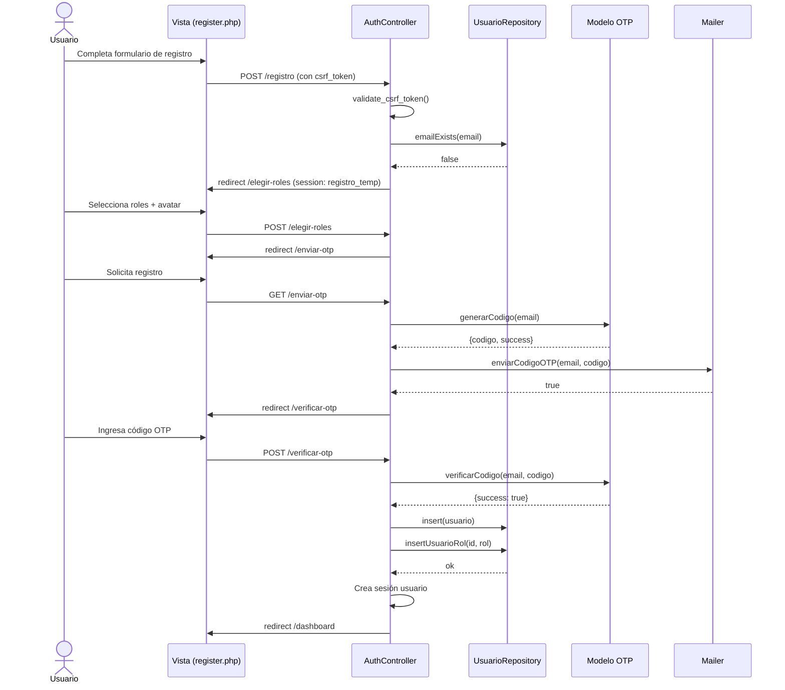
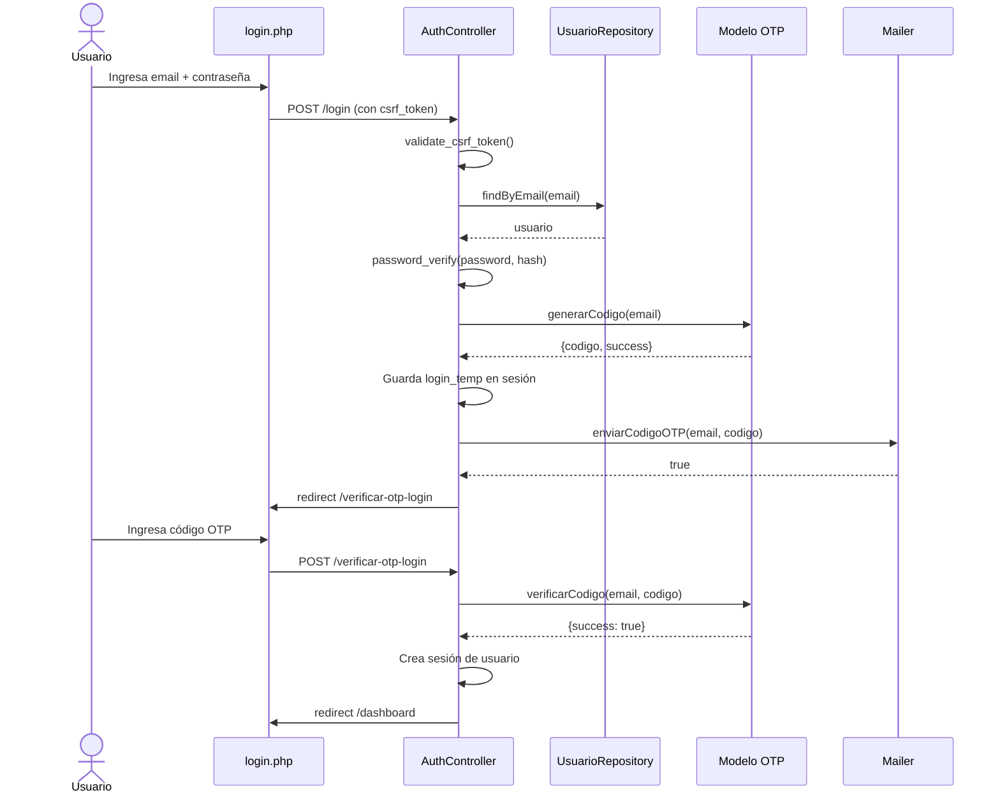
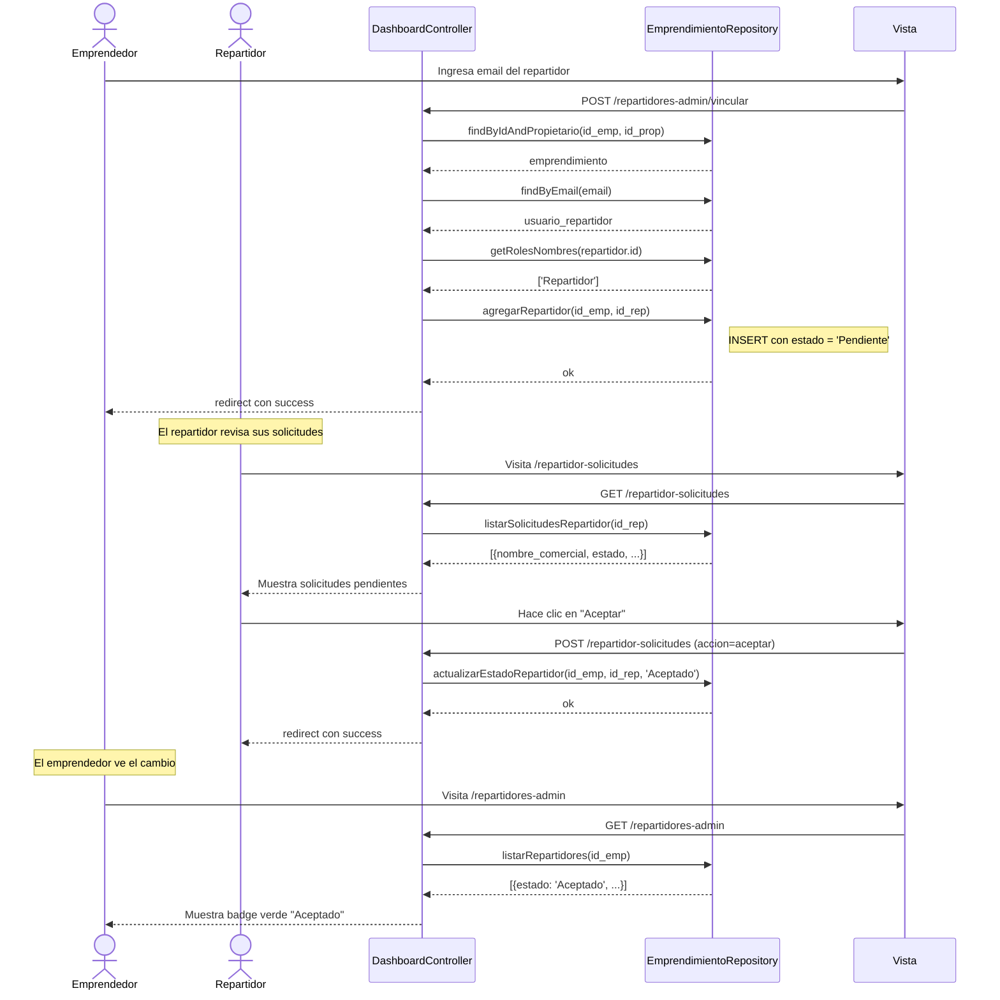
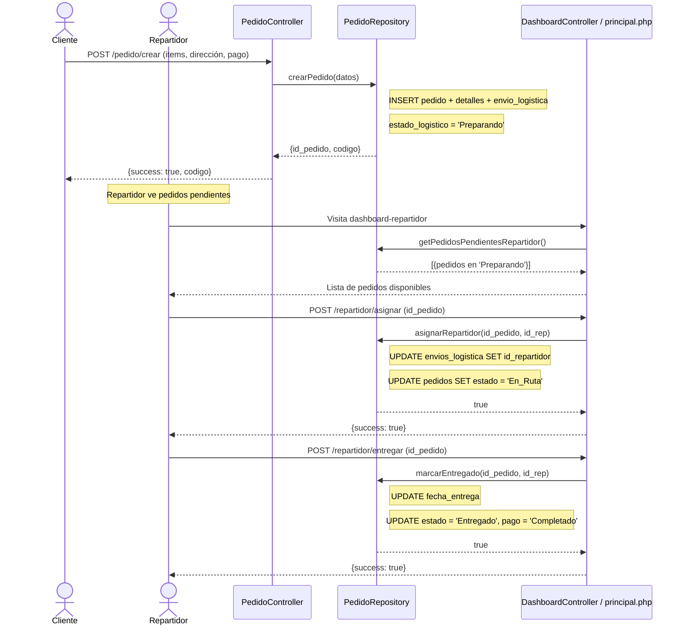
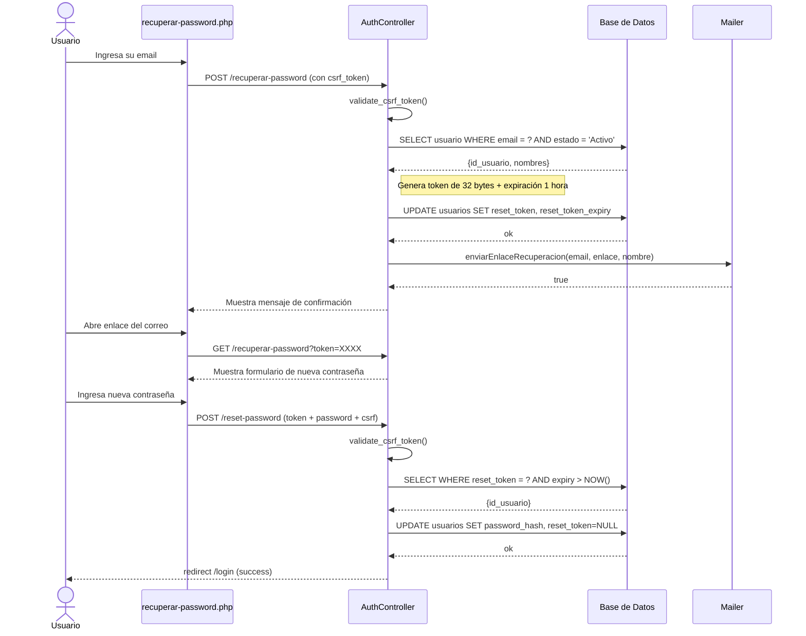
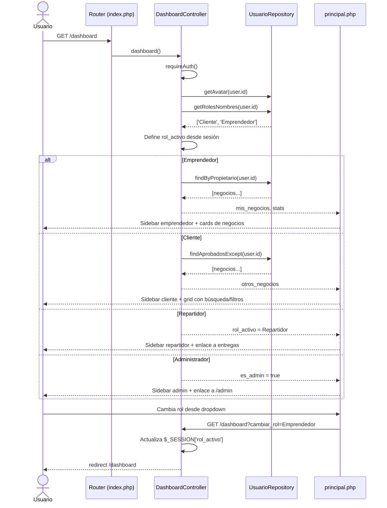

# JACHAmarket — Marketplace Multiroles

Plataforma web de comercio electrónico donde emprendedores pueden crear y personalizar sus tiendas online, clientes pueden comprar productos, repartidores gestionan entregas, y administradores controlan el sistema.

---

## Tecnologías

| | |
|---|---|
| **Backend** | PHP 8.x con PSR-4 autoload |
| **Frontend** | HTML5, CSS3, JavaScript (vanilla) |
| **Base de Datos** | MySQL / MariaDB con InnoDB |
| **Servidor** | PHP built-in server (`php -S`) o Apache |
| **Mail** | PHPMailer (Gmail SMTP) |
| **Gráficos** | Chart.js 4, FullCalendar 5 |
| **Iconos** | Font Awesome 6.5.1 |
| **Fuentes** | Google Fonts (Inter, Cormorant Garamond, DM Sans) |

---

## Funcionalidades

### Sistema de Autenticación
- Registro con validación de contraseña en tiempo real
- Verificación OTP por email (6 dígitos, 10 min de expiración)
- Login con OTP
- Selección de roles al registrarse (Cliente, Emprendedor, Repartidor)
- Selección/carga de avatar
- Cambio de rol activo desde el dashboard
- **Protección CSRF** en formularios de login y registro
- **Recuperación de contraseña** por email con token de 1 hora

### Tiendas (Storefront)
- 12 plantillas visuales con previews interactivos
- Personalización por negocio: colores, modo oscuro, tipografía, logo, banner, FAQ
- Subida de logo y banner con preview
- Carrito de compras con localStorage
- Filtro por categorías y ordenamiento (precio, nombre)
- Compra rápida con modal
- Productos con atributos JSON

### Dashboard del Emprendedor
- Crear y gestionar negocios
- Personalizar tienda (colores, logo, banner, tipografía, FAQ)
- CRUD de productos con imagen
- Vista previa en tiempo real de la personalización
- **Gestionar repartidores**: vincular/desvincular con estado de solicitud

### Dashboard del Repartidor
- Ver pedidos pendientes de entrega
- Asignarse pedidos
- Marcar como entregado
- **Calendario FullCalendar** con pedidos activos e historial
- **Solicitudes de vinculación**: aceptar o rechazar invitaciones de emprendedores
- Estadísticas: entregas hoy, ganancias, activos

### Panel de Administración
- Estadísticas del sistema (usuarios, negocios, productos, pedidos)
- Gestión de usuarios (editar roles, eliminar)
- Gestión de negocios (eliminar)
- **Analítica avanzada**: gráficos de ventas mensuales, top negocios, distribución de estados, métodos de pago, registros de usuarios
- Reporte de ventas por negocio y plantilla
- Seed de datos demo
- Reset completo de la base de datos

### Sistema de Pedidos
- Creación de pedidos con items múltiples
- Compra rápida (1 clic)
- Código de seguimiento (JACHA-XXXXXXXX)
- Estados logísticos: Preparando → En_Ruta → Entregado / Cancelado
- Estados de pago: Pendiente → Completado / Fallido / Reembolsado

### Base de Datos (Características Avanzadas)
- 17+ tablas con relaciones
- Particionamiento de pedidos por mes (13 particiones)
- Índice compuesto en productos
- Procedimiento almacenado: `sp_reporte_ventas_emprendimiento`
- Función: `fn_calcular_ganancia_neta`
- Trigger: `trg_actualizar_stock_venta`
- Tabla de auditoría: `logs_auditoria`
- 5000 productos de prueba

---

## Roles del Sistema

| Rol | Acceso |
|---|---|
| **Administrador** | Panel admin, gestión de usuarios/negocios, analítica, reportes de ventas, reset BD, seed demo |
| **Emprendedor** | Crear/personalizar tiendas, CRUD productos, gestionar repartidores |
| **Cliente** | Explorar tiendas, comprar productos, carrito de compras, historial de pedidos |
| **Repartidor** | Solicitudes de vinculación, pedidos pendientes, asignarse entregas, calendario |

Los usuarios pueden tener múltiples roles y cambiar entre ellos desde el dashboard.

---

## Diagramas de Secuencia

### 1. Registro de Usuario con OTP



### 2. Inicio de Sesión con OTP



### 3. Vinculación de Repartidor (Solicitud con Estado)



### 4. Flujo Completo de Pedido



### 5. Recuperación de Contraseña



### 6. Dashboard y Navegación por Roles



---

## Instalación

### Requisitos
- PHP 8.x con extensiones: `pdo_mysql`, `gd`, `fileinfo`, `json`, `mbstring`
- MySQL / MariaDB
- Composer
- (Opcional) Apache con mod_rewrite

### Pasos

1. Clona el repositorio:
```bash
git clone <url-del-repo> PROYECTO_GESTION_1_2026_JARJACHAS_JACHAMARKET
```

2. Instala dependencias de Composer:
```bash
cd PROYECTO_GESTION_1_2026_JARJACHAS_JACHAMARKET
composer install
```

3. Crea la base de datos `db_jacha` y ejecuta el schema:
```sql
source sql/top_3.sql
```

4. (Opcional) Ejecuta migraciones adicionales:
```sql
source sql/vincular_repartidores.sql
source sql/recuperar_password.sql
```

5. Configura credenciales SMTP en `config/.env.php`:
```php
<?php
define('SMTP_HOST', 'smtp.gmail.com');
define('SMTP_USER', 'tu_correo@gmail.com');
define('SMTP_PASS', 'tu_contraseña_de_aplicacion');
define('SMTP_PORT', 587);
define('SMTP_FROM', 'tu_correo@gmail.com');
define('SMTP_FROM_NAME', 'Jacha Marketplace');
```

6. Inicia el servidor:
```bash
php -S localhost:8000 -t public
```

7. Accede a: `http://localhost:8000`

---

## Super Administrador por Defecto

- **Email:** `mikypramos2905@gmail.com`
- **Password:** `Pomada-23`

O crea uno nuevo con `php setup-admin.php`.

---

## Estructura del Proyecto

```
PROYECTO_GESTION_1_2026_JARJACHAS_JACHAMARKET/
├── config/                  # Configuración (BD, mail, .env.php, base URL)
├── public/                  # Raíz web (index.php, assets, uploads)
│   └── assets/
│       ├── css/             # Estilos
│       ├── images/          # Imágenes del sistema
│       ├── js/              # JavaScript
│       └── uploads/         # Subidas de usuarios
├── src/
│   ├── Controllers/         # Controladores (Auth, Dashboard, Admin, etc.)
│   ├── Core/                # Router, Controller base
│   ├── Models/              # Modelos (OTP)
│   ├── Repositories/        # Acceso a datos
│   └── Views/               # Plantillas por módulo
│       ├── admin/           # Panel admin + analítica
│       ├── auth/            # Login, registro, OTP, recuperación
│       ├── dashboard/       # Principal, repartidores, solicitudes
│       ├── pages/           # Landing, explorar, plantillas
│       ├── perfil/          # Perfil de usuario
│       └── shop/            # Tiendas (themes/)
├── sql/                     # Schemas y migraciones
├── vendor/                  # Composer dependencies
├── setup-admin.php          # Script para crear super admin
├── composer.json
└── .gitignore
```

---

## Rutas Principales

| Ruta | Descripción |
|---|---|
| `/` | Landing page |
| `/login` | Iniciar sesión |
| `/registro` | Registrarse |
| `/recuperar-password` | Recuperación de contraseña |
| `/reset-password` | Cambiar contraseña (POST) |
| `/dashboard` | Dashboard principal (según rol) |
| `/tienda/{id}` | Tienda pública |
| `/productos` | Gestionar productos |
| `/plantillas` | Personalizar tienda |
| `/crear-negocio` | Crear nuevo negocio |
| `/repartidores-admin` | Gestionar repartidores (emprendedor) |
| `/repartidor-solicitudes` | Solicitudes de vinculación (repartidor) |
| `/dashboard-repartidor` | Panel de entregas + calendario |
| `/admin` | Panel de administración |
| `/admin/analytics` | Analítica con gráficos |
| `/admin/ventas` | Reporte de ventas |
| `/perfil` | Perfil de usuario |
| `/explorar` | Explorar tiendas |

---

## Archivos ignorados (no se suben al repo)

- `vendor/` — dependencias de Composer
- `.env` — variables de entorno
- `.env.php` — credenciales SMTP
- `public/uploads/` — imágenes de productos subidas
- `public/assets/uploads/` — logos y banners subidos
- `*.log` — archivos de log
