# DOCUMENTACIÓN DEL PROYECTO
## JACHAmarket — Marketplace Multiroles

---

**Versión:** 1.0
**Fecha:** Mayo 2026
**Repositorio:** PROYECTO_GESTION_1_2026_JARJACHAS_JACHAMARKET

---

# Índice

1. [Lista de Requerimientos](#1-lista-de-requerimientos)
2. [Historias de Usuario](#2-historias-de-usuario)
3. [Product Backlog](#3-product-backlog)
4. [Sprint Backlog](#4-sprint-backlog)
5. [Diagrama de Casos de Uso](#5-diagrama-de-casos-de-uso)
6. [Diagrama PERT](#6-diagrama-pert)
7. [Diagrama Entidad-Relación](#7-diagrama-entidad-relación)
8. [Diagrama de Actividades](#8-diagrama-de-actividades)
9. [Diagrama de Secuencia](#9-diagrama-de-secuencia)
10. [Diagrama de Clases](#10-diagrama-de-clases)

---

# 1. Lista de Requerimientos

**Metadatos generales:** Versión 1.0 | Fecha creación: 30/05/2026 | Última modificación: 30/05/2026 | Autor: Equipo JACHAmarket | Fuente: Stakeholders del proyecto

## 1.1 Requerimientos Funcionales

### Módulo de Autenticación

| ID | Descripción | Prio | Ver | Deps | Riesgo | Compl | Estado | Actor | Criterios Aceptación | CU Rel. |
|---|---|---|---|---|---|---|---|---|---|---|
| RF-01 | El sistema debe permitir el registro de usuarios con nombre, email, teléfono y contraseña. | Alta | 1.0 | — | Bajo | Baja | Aprobado | Visitante | Campos válidos, email único, redirección a roles | CU-01 |
| RF-02 | El sistema debe verificar la identidad del usuario mediante OTP de 6 dígitos enviado por correo electrónico. | Alta | 1.0 | RF-01 | Medio | Media | Aprobado | Visitante | Código recibido, validación con límite de intentos | CU-03 |
| RF-03 | El sistema debe permitir al usuario seleccionar uno o más roles (Cliente, Emprendedor, Repartidor) durante el registro. | Alta | 1.0 | RF-01 | Bajo | Baja | Aprobado | Visitante | Checkboxes funcionales, roles asignados correctamente | CU-05 |
| RF-04 | El sistema debe permitir el inicio de sesión con email y contraseña más verificación OTP. | Alta | 1.0 | RF-02 | Medio | Media | Aprobado | Todos | Credenciales válidas, OTP enviado y verificado | CU-02 |
| RF-05 | El sistema debe permitir el cierre de sesión. | Alta | 1.0 | RF-04 | Bajo | Baja | Aprobado | Todos | Sesión destruida, redirección a login | CU-04 |
| RF-06 | El sistema debe permitir reenviar el código OTP en caso de no recibirlo. | Media | 1.0 | RF-02 | Bajo | Baja | Aprobado | Visitante | Nuevo código generado y enviado | CU-03 |
| RF-07 | El sistema debe bloquear la generación de OTP si se exceden 3 solicitudes por hora por email. | Media | 1.0 | RF-02 | Medio | Media | Aprobado | Sistema | Bloqueo tras 3 solicitudes, mensaje de error | CU-03 |
| RF-08 | El sistema debe invalidar el OTP después de 5 intentos fallidos de verificación. | Media | 1.0 | RF-02 | Medio | Media | Aprobado | Sistema | Código marcado como usado, cuenta bloqueada | CU-03 |
| RF-09 | El sistema debe permitir la carga de avatar durante el registro con redimensionamiento automático. | Baja | 1.0 | RF-01 | Bajo | Baja | Aprobado | Visitante | Imagen válida, redimensionada a 400px, guardada como JPEG | CU-01 |

### Módulo de Roles y Permisos

| ID | Descripción | Prio | Ver | Deps | Riesgo | Compl | Estado | Actor | Criterios Aceptación | CU Rel. |
|---|---|---|---|---|---|---|---|---|---|---|
| RF-10 | El sistema debe gestionar 4 roles: Administrador, Emprendedor, Cliente y Repartidor. | Alta | 1.0 | — | Alto | Alta | Aprobado | Sistema | Roles creados en DB, asignables a usuarios | — |
| RF-11 | El sistema debe permitir que un usuario tenga múltiples roles simultáneamente. | Alta | 1.0 | RF-10 | Medio | Media | Aprobado | Todos | Usuario con 2+ roles, cambio de rol activo | CU-05 |
| RF-12 | El sistema debe permitir cambiar de rol activo desde el dashboard sin cerrar sesión. | Media | 1.0 | RF-11 | Bajo | Baja | Aprobado | Todos | Selector de rol, contenido según rol activo | CU-05 |
| RF-13 | El rol Administrador solo debe poder asignarse directamente desde la base de datos, no desde el registro. | Alta | 1.0 | RF-10 | Alto | Baja | Aprobado | Admin | Admin no aparece en registro, solo asignable por DB | — |

### Módulo de Perfil de Usuario

| ID | Descripción | Prio | Ver | Deps | Riesgo | Compl | Estado | Actor | Criterios Aceptación | CU Rel. |
|---|---|---|---|---|---|---|---|---|---|---|
| RF-14 | El sistema debe permitir al usuario editar su perfil (nombres, apellidos, teléfono, bio, ubicación). | Media | 1.0 | — | Bajo | Baja | Aprobado | Todos | Campos editables, datos guardados en DB | — |
| RF-15 | El sistema debe permitir al usuario cambiar su contraseña. | Media | 1.0 | RF-14 | Medio | Media | Aprobado | Todos | Validación de contraseña actual, hash de nueva | — |
| RF-16 | El sistema debe permitir al usuario subir, cambiar o eliminar su foto de avatar. | Baja | 1.0 | RF-14 | Bajo | Baja | Aprobado | Todos | Imagen válida, BLOB actualizado, avatar por defecto | — |
| RF-17 | El sistema debe permitir al usuario eliminar el rol de Repartidor de su cuenta. | Baja | 1.0 | RF-11 | Bajo | Baja | Aprobado | Todos | Botón quitar repartidor, registro eliminado | — |

### Módulo de Emprendimiento (Negocio)

| ID | Descripción | Prio | Ver | Deps | Riesgo | Compl | Estado | Actor | Criterios Aceptación | CU Rel. |
|---|---|---|---|---|---|---|---|---|---|---|
| RF-18 | El sistema debe permitir al Emprendedor crear un negocio seleccionando una plantilla. | Alta | 1.0 | RF-10 | Medio | Alta | Aprobado | Emprendedor | Transacción: emp + personalización + sucursal creada | CU-14 |
| RF-19 | El sistema debe permitir al Emprendedor registrar: nombre comercial, NIT, teléfono, descripción y foto de portada. | Alta | 1.0 | RF-18 | Bajo | Media | Aprobado | Emprendedor | Campos guardados, portada como BLOB | CU-14 |
| RF-20 | El sistema debe crear automáticamente una sucursal por defecto al crear el negocio. | Alta | 1.0 | RF-18 | Bajo | Baja | Aprobado | Sistema | Sucursal con nombre "Principal" y datos del negocio | CU-14 |
| RF-21 | El sistema debe permitir al Emprendedor personalizar su tienda: colores, logo, banner, tipografía y modo oscuro. | Alta | 1.0 | RF-18 | Medio | Alta | Aprobado | Emprendedor | Cambios reflejados en tienda, preview AJAX | CU-15 |
| RF-22 | El sistema debe permitir al Emprendedor gestionar las preguntas frecuentes (FAQs) de su tienda. | Media | 1.0 | RF-21 | Bajo | Media | Aprobado | Emprendedor | FAQs guardadas y visibles en tienda | CU-15 |
| RF-23 | El sistema debe permitir al Emprendedor eliminar su negocio. | Alta | 1.0 | RF-18 | Alto | Media | Aprobado | Emprendedor | Confirmación, eliminación en cascada | CU-19 |
| RF-24 | El sistema debe mostrar una vista previa en vivo de los cambios de personalización vía AJAX. | Media | 1.0 | RF-21 | Bajo | Alta | Aprobado | Emprendedor | Preview sin recargar, HTML devuelto vía AJAX | CU-15 |
| RF-25 | El sistema debe permitir al Emprendedor gestionar múltiples sucursales de su negocio. | Media | 1.0 | RF-20 | Bajo | Media | Pendiente | Emprendedor | CRUD sucursales, selección de sucursal en pedidos | CU-17 |

### Módulo de Productos

| ID | Descripción | Prio | Ver | Deps | Riesgo | Compl | Estado | Actor | Criterios Aceptación | CU Rel. |
|---|---|---|---|---|---|---|---|---|---|---|
| RF-26 | El sistema debe permitir al Emprendedor registrar productos con: nombre, descripción, categoría, precio, stock e imagen. | Alta | 1.0 | RF-18 | Alto | Alta | Aprobado | Emprendedor | Producto creado, imagen como BLOB, categoría asignada | CU-16 |
| RF-27 | El sistema debe permitir definir atributos personalizados del producto en formato JSON (talla, color, etc.). | Alta | 1.0 | RF-26 | Medio | Media | Aprobado | Emprendedor | Atributos guardados como JSON válido | CU-16 |
| RF-28 | El sistema debe permitir crear variantes de producto con SKU único y precio adicional. | Alta | 1.0 | RF-26 | Medio | Alta | Aprobado | Emprendedor | Variantes creadas, SKU único, precio adicional calculado | CU-16 |
| RF-29 | El sistema debe permitir cambiar el estado del producto entre Borrador, Publicado y Oculto. | Alta | 1.0 | RF-26 | Bajo | Baja | Aprobado | Emprendedor | Estado cambiado, productos Publicados visibles en tienda | CU-17 |
| RF-30 | El sistema debe permitir al Emprendedor editar y eliminar productos. | Alta | 1.0 | RF-26 | Alto | Media | Aprobado | Emprendedor | Edición de todos los campos, eliminación con confirmación | CU-18 |
| RF-31 | El sistema debe controlar el stock mediante movimientos kardex. | Alta | 1.0 | RF-26 | Medio | Alta | Aprobado | Sistema | Movimientos registrados por tipo, stock actualizado | — |
| RF-32 | El sistema debe reducir el stock automáticamente al realizar una venta (trigger). | Alta | 1.0 | RF-31 | Alto | Alta | Aprobado | Sistema | Trigger AFTER INSERT en detalles_pedido, stock decrementado | — |
| RF-33 | El sistema debe permitir la búsqueda de productos por nombre y categoría. | Media | 1.0 | RF-26 | Bajo | Media | Pendiente | Cliente | Resultados filtrados, búsqueda por nombre o categoría | CU-12 |

### Módulo de Tienda (Frontend Público)

| ID | Descripción | Prio | Ver | Deps | Riesgo | Compl | Estado | Actor | Criterios Aceptación | CU Rel. |
|---|---|---|---|---|---|---|---|---|---|---|
| RF-34 | El sistema debe mostrar una página principal con negocios destacados (hasta 6). | Alta | 1.0 | RF-18 | Bajo | Media | Aprobado | Visitante | 6 negocios destacados, imagen portada, nombre | CU-06 |
| RF-35 | El sistema debe permitir explorar todos los negocios aprobados. | Alta | 1.0 | RF-34 | Bajo | Media | Aprobado | Cliente | Lista completa de negocios aprobados | CU-06 |
| RF-36 | El sistema debe mostrar la tienda de cada negocio con sus productos publicados. | Alta | 1.0 | RF-35, RF-29 | Bajo | Alta | Aprobado | Cliente | Tienda con plantilla, productos visibles con precio | CU-07 |
| RF-37 | El sistema debe mostrar la tienda con la plantilla y personalización del negocio. | Alta | 1.0 | RF-21, RF-36 | Bajo | Media | Aprobado | Cliente | Colores, logo, banner aplicados desde personalización | CU-07 |

### Módulo de Carrito de Compras

| ID | Descripción | Prio | Ver | Deps | Riesgo | Compl | Estado | Actor | Criterios Aceptación | CU Rel. |
|---|---|---|---|---|---|---|---|---|---|---|
| RF-38 | El sistema debe permitir al Cliente agregar productos al carrito de compras. | Alta | 1.0 | RF-36 | Medio | Media | Pendiente | Cliente | Item agregado con variante y cantidad, confirmación visual | CU-09 |
| RF-39 | El sistema debe permitir al Cliente visualizar el carrito con el detalle de items, cantidades y total. | Alta | 1.0 | RF-38 | Bajo | Media | Pendiente | Cliente | Lista de items, subtotales, total general | CU-09 |
| RF-40 | El sistema debe permitir al Cliente modificar cantidades y eliminar items del carrito. | Alta | 1.0 | RF-38 | Bajo | Baja | Pendiente | Cliente | Cantidad actualizable, item removible, total recalculado | CU-09 |
| RF-41 | El sistema debe mantener el carrito en sesión durante la navegación. | Alta | 1.0 | RF-38 | Medio | Media | Pendiente | Sistema | Carrito persistente entre páginas, no se pierde al navegar | CU-09 |

### Módulo de Pedidos

| ID | Descripción | Prio | Ver | Deps | Riesgo | Compl | Estado | Actor | Criterios Aceptación | CU Rel. |
|---|---|---|---|---|---|---|---|---|---|---|
| RF-42 | El sistema debe permitir realizar el checkout del carrito generando un pedido. | Alta | 1.0 | RF-39 | Alto | Alta | Pendiente | Cliente | Pedido creado con items, tracking, total | CU-10 |
| RF-43 | El sistema debe generar un código de seguimiento único con formato JACHA-XXXXX. | Alta | 1.0 | RF-42 | Bajo | Baja | Aprobado | Sistema | Código único generado al crear pedido | CU-10 |
| RF-44 | El sistema debe permitir compra rápida de un solo producto. | Media | 1.0 | RF-36 | Medio | Media | Aprobado | Cliente | Compra sin carrito, dirección desde perfil | CU-09 |
| RF-45 | El sistema debe calcular subtotal, costo de envío (15 Bs) y total del pedido. | Alta | 1.0 | RF-42 | Bajo | Media | Aprobado | Sistema | Cálculos correctos, envío fijo de 15 Bs | CU-10 |
| RF-46 | El sistema debe soportar métodos de pago: QR, Tarjeta, Efectivo y Transferencia. | Alta | 1.0 | RF-42 | Medio | Media | Aprobado | Cliente | 4 métodos disponibles, selección en checkout | CU-10 |
| RF-47 | El sistema debe generar un código QR con los datos del pedido al seleccionar pago QR. | Media | 1.0 | RF-46 | Bajo | Media | Pendiente | Sistema | QR generado con monto, tracking, negocio | CU-10 |
| RF-48 | El sistema debe registrar la dirección de entrega del pedido. | Alta | 1.0 | RF-42 | Bajo | Baja | Aprobado | Cliente | Dirección guardada en pedido, obtenida de formulario o perfil | CU-10 |
| RF-49 | El historial de pedidos debe estar particionado por mes en la base de datos. | Alta | 1.0 | RF-64 | Medio | Alta | Aprobado | Sistema | 13 particiones por mes, consultas por rango de fechas | — |

### Módulo de Delivery (Repartidor)

| ID | Descripción | Prio | Ver | Deps | Riesgo | Compl | Estado | Actor | Criterios Aceptación | CU Rel. |
|---|---|---|---|---|---|---|---|---|---|---|
| RF-50 | El sistema debe mostrar al Repartidor los pedidos pendientes de asignación. | Alta | 1.0 | RF-42 | Medio | Media | Aprobado | Repartidor | Lista JSON de pedidos sin repartidor asignado | CU-20 |
| RF-51 | El sistema debe permitir al Repartidor asignarse un pedido y cambiar su estado a "En Ruta". | Alta | 1.0 | RF-50 | Medio | Media | Aprobado | Repartidor | Pedido asignado, fecha despacho registrada, estado actualizado | CU-21 |
| RF-52 | El sistema debe permitir al Repartidor marcar un pedido como "Entregado". | Alta | 1.0 | RF-51 | Bajo | Baja | Aprobado | Repartidor | Fecha entrega registrada, estado actualizado | CU-22 |
| RF-53 | El sistema debe actualizar el estado del pago a "Completado" al entregar. | Alta | 1.0 | RF-52 | Bajo | Baja | Aprobado | Sistema | Pago marcado como completado junto con entrega | CU-22 |
| RF-54 | El sistema debe mostrar estadísticas al Repartidor: entregas del día, totales, ganancias. | Media | 1.0 | RF-50 | Bajo | Media | Aprobado | Repartidor | Dashboard con conteo de entregas y ganancias estimadas | CU-23 |

### Módulo de Historial del Emprendedor

| ID | Descripción | Prio | Ver | Deps | Riesgo | Compl | Estado | Actor | Criterios Aceptación | CU Rel. |
|---|---|---|---|---|---|---|---|---|---|---|
| RF-55 | El sistema debe permitir al Emprendedor ver los pedidos recibidos en su negocio. | Alta | 1.0 | RF-18, RF-42 | Medio | Media | Pendiente | Emprendedor | Lista de pedidos del negocio con cliente, total, estado | CU-18 |
| RF-56 | El sistema debe mostrar estadísticas de ventas al Emprendedor. | Media | 1.0 | RF-55 | Bajo | Media | Pendiente | Emprendedor | Total ventas, ingresos, pedidos por estado | CU-18 |

### Módulo de Administración

| ID | Descripción | Prio | Ver | Deps | Riesgo | Compl | Estado | Actor | Criterios Aceptación | CU Rel. |
|---|---|---|---|---|---|---|---|---|---|---|
| RF-57 | El sistema debe mostrar al Administrador un panel con estadísticas globales (usuarios, negocios, productos, pedidos). | Alta | 1.0 | RF-10 | Bajo | Media | Aprobado | Admin | Conteo total de cada entidad visible en panel | CU-26 |
| RF-58 | El sistema debe permitir al Administrador gestionar usuarios (editar datos, roles, estado, eliminar). | Alta | 1.0 | RF-10, RF-14 | Alto | Alta | Aprobado | Admin | Lista de usuarios, edición de campos y roles, eliminación | CU-27 |
| RF-59 | El sistema debe proteger al super administrador (email: mikypramos2905@gmail.com) de ser eliminado. | Alta | 1.0 | RF-58 | Alto | Baja | Aprobado | Sistema | Protección por email, botón deshabilitado / error al eliminar | CU-27 |
| RF-60 | El sistema debe permitir al Administrador eliminar negocios. | Alta | 1.0 | RF-18 | Alto | Media | Aprobado | Admin | Negocio eliminado con todos sus datos asociados | CU-28 |
| RF-61 | El sistema debe mostrar un reporte de ventas con filtros por negocio y fechas. | Alta | 1.0 | RF-42 | Bajo | Alta | Aprobado | Admin | Filtros aplicados, tabla de pedidos y totales | CU-29 |
| RF-62 | El sistema debe permitir al Administrador ejecutar seed de datos de demostración. | Media | 1.0 | RF-64 | Alto | Media | Aprobado | Admin | Datos demo insertados sin duplicar | CU-30 |
| RF-63 | El sistema debe permitir al Administrador resetear la base de datos completa. | Alta | 1.0 | RF-64 | Alto | Media | Aprobado | Admin | Confirmación "RESET", DB eliminada y recreada, datos iniciales | CU-30 |

### Módulo de Base de Datos

| ID | Descripción | Prio | Ver | Deps | Riesgo | Compl | Estado | Actor | Criterios Aceptación | CU Rel. |
|---|---|---|---|---|---|---|---|---|---|---|
| RF-64 | El sistema debe utilizar una base de datos MySQL/MariaDB con 17 tablas. | Alta | 1.0 | — | Alto | Alta | Aprobado | Sistema | 17 tablas creadas con relaciones, índices y FK | — |
| RF-65 | El sistema debe implementar una función para calcular ganancia neta. | Media | 1.0 | RF-64 | Medio | Alta | Aprobado | Sistema | Función ejecutable, retorna ganancia neta con impuesto | — |
| RF-66 | El sistema debe implementar un procedimiento almacenado para reporte de ventas. | Media | 1.0 | RF-64 | Medio | Alta | Aprobado | Sistema | SP ejecutable, retorna pedidos por rango de fechas | CU-29 |
| RF-67 | El sistema debe implementar un trigger para actualizar stock al vender. | Alta | 1.0 | RF-64 | Alto | Alta | Aprobado | Sistema | Trigger AFTER INSERT, stock decrementado en productos | — |
| RF-68 | El sistema debe registrar movimientos kardex para control de inventario. | Alta | 1.0 | RF-64 | Medio | Alta | Aprobado | Sistema | Movimientos por tipo, responsable y fecha registrados | — |
| RF-69 | El sistema debe auditar las operaciones mediante la tabla logs_auditoria. | Media | 1.0 | RF-64 | Bajo | Alta | Aprobado | Sistema | Registro de INSERT/UPDATE/DELETE con datos viejos y nuevos | — |

## 1.2 Requerimientos No Funcionales

| ID | Descripción | Prio | Ver | Deps | Riesgo | Compl | Estado | Actor | Criterios Aceptación | CU Rel. |
|---|---|---|---|---|---|---|---|---|---|---|
| RNF-01 | El sistema debe ser desarrollado en PHP 8.x con arquitectura MVC. | Alta | 1.0 | — | Alto | Alta | Aprobado | Sistema | Código organizado en Modelo-Vista-Controlador | — |
| RNF-02 | El sistema debe usar MySQL/MariaDB con motor InnoDB para integridad referencial. | Alta | 1.0 | — | Alto | Alta | Aprobado | Sistema | Tablas InnoDB, FK con ON DELETE CASCADE | — |
| RNF-03 | El sistema debe ser responsive y funcionar en dispositivos móviles y desktop. | Alta | 1.0 | — | Medio | Alta | Aprobado | Todos | Diseño adaptable a 320px-1920px | — |
| RNF-04 | El sistema debe cargar la página principal en menos de 3 segundos. | Media | 1.0 | RNF-01 | Medio | Alta | Aprobado | Todos | Tiempo de carga medible < 3s | — |
| RNF-05 | Las contraseñas deben almacenarse usando password_hash() de PHP. | Alta | 1.0 | RNF-01 | Alto | Baja | Aprobado | Sistema | Hash generado con PASSWORD_DEFAULT | — |
| RNF-06 | Las imágenes deben almacenarse como BLOB en la base de datos (MEDIUMBLOB). | Alta | 1.0 | RF-64 | Medio | Media | Aprobado | Sistema | Imágenes almacenadas como MEDIUMBLOB con MIME type | — |
| RNF-07 | El sistema debe usar PHPMailer con SMTP de Gmail para el envío de correos. | Alta | 1.0 | RNF-01 | Medio | Media | Aprobado | Sistema | Correos enviados vía SMTP Gmail, puerto 587 STARTTLS | — |
| RNF-08 | El sistema debe implementar un front controller con rutas limpias (mod_rewrite). | Alta | 1.0 | RNF-01 | Medio | Media | Aprobado | Sistema | .htaccess rewrite, index.php como punto de entrada único | — |
| RNF-09 | El sistema debe manejar zonas horarias (America/La_Paz). | Media | 1.0 | — | Bajo | Baja | Aprobado | Sistema | Configuración de zona horaria en PHP y MySQL | — |
| RNF-10 | El sistema debe usar sesiones PHP para mantener el estado del usuario. | Alta | 1.0 | RNF-01 | Medio | Baja | Aprobado | Sistema | Sesión iniciada al autenticar, datos de usuario en $_SESSION | — |

---

# 2. Historias de Usuario

---

### MÓDULO 1: AUTENTICACIÓN Y ACCESO

```
Número: 1	Usuario: Visitante	Requerimiento: RF-01
Nombre de Historia de Usuario: Registro de Usuario
Prioridad: Alta	Riesgo de Desarrollo: Medio
Puntos Estimado: 5	Iteración Asignada: 1
Programador Responsable: Equipo JACHAmarket
Descripción: Como visitante necesito registrarme ingresando mis datos personales (nombres, apellidos, email, teléfono y contraseña) para poder acceder a los servicios de la plataforma.
Validación: El formulario de registro valida todos los campos obligatorios, verifica que el email no esté duplicado, guarda los datos en sesión temporal y redirige a la pantalla de selección de roles.
```

```
Número: 2	Usuario: Visitante	Requerimiento: RF-03
Nombre de Historia de Usuario: Selección de Roles
Prioridad: Alta	Riesgo de Desarrollo: Bajo
Puntos Estimado: 3	Iteración Asignada: 1
Programador Responsable: Equipo JACHAmarket
Descripción: Como visitante necesito seleccionar uno o más roles (Cliente, Emprendedor, Repartidor) después de registrarme para definir mi tipo de participación en la plataforma.
Validación: Se presenta interfaz con checkboxes para cada rol con su descripción, permite selección múltiple y al confirmar redirige a la verificación OTP guardando los roles en sesión.
```

```
Número: 3	Usuario: Visitante	Requerimiento: RF-02
Nombre de Historia de Usuario: Verificación OTP
Prioridad: Alta	Riesgo de Desarrollo: Medio
Puntos Estimado: 8	Iteración Asignada: 1
Programador Responsable: Equipo JACHAmarket
Descripción: Como visitante necesito verificar mi identidad mediante un código de 6 dígitos enviado a mi correo electrónico para completar el registro o inicio de sesión de forma segura.
Validación: El sistema genera un código OTP, lo envía por email, permite al usuario ingresarlo, valida con límite de 5 intentos y 10 minutos de vigencia, y completa la autenticación al ser correcto.
```

```
Número: 4	Usuario: Todos	Requerimiento: RF-04
Nombre de Historia de Usuario: Inicio de Sesión
Prioridad: Alta	Riesgo de Desarrollo: Medio
Puntos Estimado: 5	Iteración Asignada: 1
Programador Responsable: Equipo JACHAmarket
Descripción: Como usuario registrado necesito iniciar sesión ingresando mi email y contraseña para acceder al panel de control según el rol que tenga asignado.
Validación: Se presenta el formulario de login, el sistema verifica las credenciales contra la base de datos, genera un OTP y lo envía al email, y solo permite el acceso tras verificar el código, redirigiendo al dashboard correspondiente.
```

```
Número: 5	Usuario: Todos	Requerimiento: RF-05
Nombre de Historia de Usuario: Cierre de Sesión
Prioridad: Alta	Riesgo de Desarrollo: Bajo
Puntos Estimado: 1	Iteración Asignada: 1
Programador Responsable: Equipo JACHAmarket
Descripción: Como usuario autenticado necesito cerrar mi sesión para salir de forma segura de la plataforma.
Validación: El sistema destruye la sesión actual y redirige al formulario de login, impidiendo el acceso a rutas protegidas sin autenticación.
```

```
Número: 6	Usuario: Visitante	Requerimiento: RF-09
Nombre de Historia de Usuario: Carga de Avatar en Registro
Prioridad: Baja	Riesgo de Desarrollo: Bajo
Puntos Estimado: 2	Iteración Asignada: 1
Programador Responsable: Equipo JACHAmarket
Descripción: Como visitante necesito poder subir una foto de avatar durante el registro para personalizar mi perfil desde el inicio.
Validación: El sistema permite seleccionar una imagen, valida el formato MIME, la redimensiona a máximo 400px, la convierte a JPEG y la guarda como BLOB temporal hasta completar el registro.
```

---

### MÓDULO 2: ROLES Y PERMISOS

```
Número: 7	Usuario: Sistema / Admin	Requerimiento: RF-10, RF-11, RF-12, RF-13
Nombre de Historia de Usuario: Gestión de Roles y Permisos
Prioridad: Alta	Riesgo de Desarrollo: Alto
Puntos Estimado: 5	Iteración Asignada: 1
Programador Responsable: Equipo JACHAmarket
Descripción: Como administrador del sistema necesito gestionar 4 roles (Administrador, Emprendedor, Cliente, Repartidor) permitiendo que un usuario tenga múltiples roles y pueda cambiar entre ellos desde el dashboard, asegurando que el rol Administrador solo se asigne desde la base de datos.
Validación: Los roles están creados en la tabla roles, los usuarios pueden tener múltiples roles vía usuario_roles, el cambio de rol activo funciona desde el dashboard y el rol Administrador no aparece como opción en el registro de usuario.
```

---

### MÓDULO 3: PERFIL DE USUARIO

```
Número: 8	Usuario: Todos	Requerimiento: RF-14, RF-15
Nombre de Historia de Usuario: Edición de Perfil y Contraseña
Prioridad: Media	Riesgo de Desarrollo: Bajo
Puntos Estimado: 5	Iteración Asignada: 2
Programador Responsable: Equipo JACHAmarket
Descripción: Como usuario autenticado necesito editar mi perfil (nombres, apellidos, teléfono, bio, ubicación) y cambiar mi contraseña para mantener mis datos actualizados.
Validación: El formulario de perfil carga los datos actuales, permite modificarlos y guarda los cambios en la base de datos. El cambio de contraseña requiere la contraseña actual y valida la nueva con confirmaación.
```

```
Número: 9	Usuario: Todos	Requerimiento: RF-16
Nombre de Historia de Usuario: Gestión de Avatar
Prioridad: Baja	Riesgo de Desarrollo: Bajo
Puntos Estimado: 3	Iteración Asignada: 2
Programador Responsable: Equipo JACHAmarket
Descripción: Como usuario autenticado necesito subir, cambiar o eliminar mi foto de avatar para personalizar mi perfil.
Validación: El sistema permite subir una imagen válida, la almacena como BLOB en la base de datos, permite reemplazarla por otra y eliminarla restaurando el avatar por defecto.
```

```
Número: 10	Usuario: Todos	Requerimiento: RF-17
Nombre de Historia de Usuario: Eliminación de Rol Repartidor
Prioridad: Baja	Riesgo de Desarrollo: Bajo
Puntos Estimado: 2	Iteración Asignada: 2
Programador Responsable: Equipo JACHAmarket
Descripción: Como usuario con rol Repartidor necesito poder eliminar ese rol de mi cuenta si ya no deseo realizar entregas.
Validación: El sistema muestra un botón "Quitar repartidor" que al confirmar elimina el registro usuario_rol correspondiente y actualiza los roles del usuario en sesión.
```

---

### MÓDULO 4: EMPRENDIMIENTO Y PLANTILLAS

```
Número: 11	Usuario: Emprendedor	Requerimiento: HU-11
Nombre de Historia de Usuario: Visualización de Plantillas Disponibles
Prioridad: Alta	Riesgo de Desarrollo: Bajo
Puntos Estimado: 3	Iteración Asignada: 2
Programador Responsable: Equipo JACHAmarket
Descripción: Como emprendedor necesito ver todas las plantillas disponibles con su previsualización para elegir la que mejor se adapte al rubro de mi negocio.
Validación: Se muestra una galería con las 12 plantillas activas, cada una con nombre, descripción, colores predeterminados e imagen de previsualización, permitiendo seleccionar una para crear el negocio.
```

```
Número: 12	Usuario: Emprendedor	Requerimiento: RF-18, RF-19, RF-20
Nombre de Historia de Usuario: Creación de Negocio con Plantilla
Prioridad: Alta	Riesgo de Desarrollo: Medio
Puntos Estimado: 8	Iteración Asignada: 2
Programador Responsable: Equipo JACHAmarket
Descripción: Como emprendedor necesito crear mi negocio seleccionando una plantilla y registrando mi nombre comercial, NIT, teléfono, descripción y foto de portada para empezar a vender en el marketplace.
Validación: El sistema ejecuta una transacción que inserta el emprendimiento, su personalización con los colores de la plantilla seleccionada y una sucursal por defecto, redirigiendo luego a la pantalla de personalización.
```

```
Número: 13	Usuario: Emprendedor	Requerimiento: RF-21, RF-22, RF-24
Nombre de Historia de Usuario: Personalización de Tienda
Prioridad: Alta	Riesgo de Desarrollo: Alto
Puntos Estimado: 8	Iteración Asignada: 2
Programador Responsable: Equipo JACHAmarket
Descripción: Como emprendedor necesito personalizar los colores, logo, banner, tipografía, modo oscuro y preguntas frecuentes de mi tienda para que refleje la identidad de mi marca.
Validación: El panel de personalización permite modificar todos los parámetros visuales, subir imágenes como BLOB, previsualizar cambios en vivo vía AJAX y guardar los cambios en la base de datos actualizando la personalización del emprendimiento.
```

```
Número: 14	Usuario: Emprendedor	Requerimiento: RF-25
Nombre de Historia de Usuario: Gestión de Sucursales
Prioridad: Media	Riesgo de Desarrollo: Bajo
Puntos Estimado: 5	Iteración Asignada: 4
Programador Responsable: Equipo JACHAmarket
Descripción: Como emprendedor necesito gestionar las sucursales de mi negocio (agregar, editar, eliminar) para indicar los lugares de origen de los pedidos.
Validación: El sistema permite crear sucursales con nombre, dirección y ciudad; editarlas y eliminarlas. La sucursal por defecto se crea automáticamente al registrar el negocio.
```

```
Número: 15	Usuario: Emprendedor	Requerimiento: RF-23
Nombre de Historia de Usuario: Eliminación de Negocio
Prioridad: Alta	Riesgo de Desarrollo: Alto
Puntos Estimado: 2	Iteración Asignada: 2
Programador Responsable: Equipo JACHAmarket
Descripción: Como emprendedor necesito eliminar mi negocio si ya no deseo continuar en la plataforma para darme de baja.
Validación: El sistema solicita confirmación antes de eliminar, y al confirmar elimina en cascada el emprendimiento, su personalización, sucursales y productos asociados de la base de datos.
```

---

### MÓDULO 5: PRODUCTOS

```
Número: 16	Usuario: Emprendedor	Requerimiento: RF-26, RF-27
Nombre de Historia de Usuario: Registro de Producto con Atributos
Prioridad: Alta	Riesgo de Desarrollo: Alto
Puntos Estimado: 8	Iteración Asignada: 3
Programador Responsable: Equipo JACHAmarket
Descripción: Como emprendedor necesito registrar productos con nombre, descripción, categoría, precio, stock, imagen y atributos personalizados en JSON para ofrecerlos a los clientes.
Validación: El formulario de producto guarda todos los campos en la base de datos, la imagen se almacena como BLOB con su MIME type, y los atributos se guardan como JSON válido asociado al producto.
```

```
Número: 17	Usuario: Emprendedor	Requerimiento: RF-28
Nombre de Historia de Usuario: Creación de Variantes de Producto
Prioridad: Alta	Riesgo de Desarrollo: Medio
Puntos Estimado: 5	Iteración Asignada: 3
Programador Responsable: Equipo JACHAmarket
Descripción: Como emprendedor necesito crear variantes de mis productos con SKU único y precio adicional para ofrecer tallas, colores u otras opciones.
Validación: El sistema permite agregar variantes con atributo/valor (hasta 2 pares), genera o valida un SKU único por variante, y calcula el precio final sumando el precio base más el precio adicional.
```

```
Número: 18	Usuario: Emprendedor	Requerimiento: RF-29
Nombre de Historia de Usuario: Gestión de Estado de Producto
Prioridad: Alta	Riesgo de Desarrollo: Bajo
Puntos Estimado: 2	Iteración Asignada: 3
Programador Responsable: Equipo JACHAmarket
Descripción: Como emprendedor necesito cambiar el estado de mis productos entre Borrador, Publicado y Oculto para controlar su visibilidad en la tienda.
Validación: El selector de estado permite cambiar entre los tres valores, los productos en estado Publicado se muestran en la tienda pública, los Ocultos y Borrador no son visibles para los clientes.
```

```
Número: 19	Usuario: Emprendedor	Requerimiento: RF-30
Nombre de Historia de Usuario: Edición y Eliminación de Productos
Prioridad: Alta	Riesgo de Desarrollo: Medio
Puntos Estimado: 3	Iteración Asignada: 3
Programador Responsable: Equipo JACHAmarket
Descripción: Como emprendedor necesito editar y eliminar mis productos para mantener actualizado mi catálogo.
Validación: El sistema permite modificar todos los campos del producto existente y guarda los cambios. La eliminación solicita confirmación y solo permite eliminar productos del negocio propio.
```

```
Número: 20	Usuario: Cliente	Requerimiento: RF-33
Nombre de Historia de Usuario: Búsqueda de Productos
Prioridad: Media	Riesgo de Desarrollo: Bajo
Puntos Estimado: 3	Iteración Asignada: 3
Programador Responsable: Equipo JACHAmarket
Descripción: Como cliente necesito buscar productos por nombre o categoría dentro de la tienda de un negocio para encontrar lo que necesito más rápido.
Validación: El campo de búsqueda filtra los productos por nombre y el selector de categoría filtra por categoría, mostrando solo los resultados que coinciden con los criterios ingresados.
```

---

### MÓDULO 6: TIENDA PÚBLICA

```
Número: 21	Usuario: Cliente / Visitante	Requerimiento: RF-34, RF-35
Nombre de Historia de Usuario: Exploración de Negocios
Prioridad: Alta	Riesgo de Desarrollo: Bajo
Puntos Estimado: 3	Iteración Asignada: 1
Programador Responsable: Equipo JACHAmarket
Descripción: Como cliente necesito explorar los negocios disponibles en la plataforma y ver los destacados en la página principal para descubrir productos de mi interés.
Validación: La página principal muestra hasta 6 negocios destacados con su nombre y portada. La página de explorar lista todos los negocios aprobados con enlace a cada tienda.
```

```
Número: 22	Usuario: Cliente	Requerimiento: RF-36, RF-37
Nombre de Historia de Usuario: Visita a Tienda de Negocio
Prioridad: Alta	Riesgo de Desarrollo: Medio
Puntos Estimado: 5	Iteración Asignada: 3
Programador Responsable: Equipo JACHAmarket
Descripción: Como cliente necesito visitar la tienda de un negocio y ver sus productos publicados renderizados con su plantilla y personalización para decidir qué comprar.
Validación: La tienda se muestra con los colores, logo, banner y tipografía personalizados del negocio. Solo se muestran productos en estado Publicado con su imagen, nombre, precio y variantes disponibles.
```

---

### MÓDULO 7: CARRITO DE COMPRAS

```
Número: 23	Usuario: Cliente	Requerimiento: RF-38, RF-41
Nombre de Historia de Usuario: Agregar Productos al Carrito
Prioridad: Alta	Riesgo de Desarrollo: Medio
Puntos Estimado: 5	Iteración Asignada: 3
Programador Responsable: Equipo JACHAmarket
Descripción: Como cliente necesito agregar productos al carrito de compras seleccionando variante y cantidad para acumular items antes de comprar.
Validación: El botón "Agregar al carrito" guarda el producto con su variante y cantidad en la sesión del usuario, muestra una confirmación visual y el carrito persiste durante la navegación.
```

```
Número: 24	Usuario: Cliente	Requerimiento: RF-39, RF-40
Nombre de Historia de Usuario: Gestión del Carrito de Compras
Prioridad: Alta	Riesgo de Desarrollo: Bajo
Puntos Estimado: 3	Iteración Asignada: 3
Programador Responsable: Equipo JACHAmarket
Descripción: Como cliente necesito ver mi carrito con el detalle de productos, modificar cantidades y eliminar items para revisar mi compra antes de pagar.
Validación: La vista del carrito lista todos los items con imagen, nombre, cantidad, precio unitario y subtotal. Permite modificar cantidades y eliminar items, recalculando el total automáticamente.
```

---

### MÓDULO 8: PEDIDOS Y PAGOS

```
Número: 25	Usuario: Cliente	Requerimiento: RF-42, RF-45, RF-46, RF-47, RF-48
Nombre de Historia de Usuario: Checkout y Pago de Pedido
Prioridad: Alta	Riesgo de Desarrollo: Alto
Puntos Estimado: 8	Iteración Asignada: 3
Programador Responsable: Equipo JACHAmarket
Descripción: Como cliente necesito realizar el checkout de mi carrito eligiendo método de pago y dirección de entrega para finalizar mi compra.
Validación: El formulario de checkout solicita dirección de entrega, permite seleccionar entre QR, Tarjeta, Efectivo o Transferencia, calcula subtotal + envío (15 Bs) = total. Si es pago QR, genera un código QR con los datos del pedido. Al confirmar crea el pedido con código de seguimiento JACHA-XXXXX.
```

```
Número: 26	Usuario: Cliente	Requerimiento: RF-44
Nombre de Historia de Usuario: Compra Rápida
Prioridad: Media	Riesgo de Desarrollo: Medio
Puntos Estimado: 5	Iteración Asignada: 3
Programador Responsable: Equipo JACHAmarket
Descripción: Como cliente necesito comprar un producto rápidamente sin pasar por el carrito para agilizar la compra cuando solo necesito un artículo.
Validación: El botón "Comprar ahora" crea el pedido directamente tomando la dirección del perfil del usuario, calculando automáticamente el subtotal y envío, y generando el pedido en un solo paso.
```

```
Número: 27	Usuario: Cliente	Requerimiento: RF-43, RF-49
Nombre de Historia de Usuario: Historial de Pedidos del Cliente
Prioridad: Media	Riesgo de Desarrollo: Medio
Puntos Estimado: 3	Iteración Asignada: 3
Programador Responsable: Equipo JACHAmarket
Descripción: Como cliente necesito ver el historial de mis pedidos con su estado y total para dar seguimiento a mis compras.
Validación: La página de historial lista los últimos 20 pedidos del cliente mostrando código de seguimiento, fecha, total, estado logístico y estado de pago, con detalle de los items de cada pedido.
```

---

### MÓDULO 9: DELIVERY Y LOGÍSTICA

```
Número: 28	Usuario: Repartidor	Requerimiento: RF-50
Nombre de Historia de Usuario: Visualización de Pedidos Pendientes
Prioridad: Alta	Riesgo de Desarrollo: Medio
Puntos Estimado: 5	Iteración Asignada: 4
Programador Responsable: Equipo JACHAmarket
Descripción: Como repartidor necesito ver los pedidos pendientes de asignación con datos del negocio, cliente y dirección para elegir cuáles entregar.
Validación: El dashboard del repartidor muestra una lista de pedidos en estado "Preparando" obtenida vía API JSON, con información del negocio de origen, cliente destino y dirección de entrega.
```

```
Número: 29	Usuario: Repartidor	Requerimiento: RF-51, RF-52, RF-53
Nombre de Historia de Usuario: Asignación y Entrega de Pedidos
Prioridad: Alta	Riesgo de Desarrollo: Alto
Puntos Estimado: 5	Iteración Asignada: 4
Programador Responsable: Equipo JACHAmarket
Descripción: Como repartidor necesito asignarme un pedido para su entrega, marcarlo "En Ruta" y finalmente "Entregado" para completar el proceso de delivery.
Validación: El botón "Asignarme" cambia el estado a "En Ruta" y registra fecha de despacho. El botón "Entregado" cambia el estado logístico a "Entregado", el pago a "Completado" y registra la fecha de entrega.
```

```
Número: 30	Usuario: Repartidor	Requerimiento: RF-54
Nombre de Historia de Usuario: Estadísticas de Repartidor
Prioridad: Media	Riesgo de Desarrollo: Bajo
Puntos Estimado: 3	Iteración Asignada: 4
Programador Responsable: Equipo JACHAmarket
Descripción: Como repartidor necesito ver mis estadísticas de entregas del día, totales y ganancias estimadas para conocer mi desempeño.
Validación: El dashboard muestra entregas realizadas hoy, total de entregas históricas, ganancias estimadas del día y totales, y cantidad de pedidos activos actuales.
```

---

### MÓDULO 10: HISTORIAL DEL EMPRENDEDOR

```
Número: 31	Usuario: Emprendedor	Requerimiento: RF-55
Nombre de Historia de Usuario: Visualización de Pedidos Recibidos
Prioridad: Alta	Riesgo de Desarrollo: Medio
Puntos Estimado: 5	Iteración Asignada: 4
Programador Responsable: Equipo JACHAmarket
Descripción: Como emprendedor necesito ver los pedidos que han realizado en mi negocio con datos del cliente, productos y estado para gestionar las ventas.
Validación: La sección de pedidos lista todos los pedidos asociados al emprendimiento del emprendedor, mostrando cliente, items comprados, total, estado logístico y estado de pago.
```

```
Número: 32	Usuario: Emprendedor	Requerimiento: RF-56
Nombre de Historia de Usuario: Estadísticas de Ventas
Prioridad: Media	Riesgo de Desarrollo: Bajo
Puntos Estimado: 3	Iteración Asignada: 4
Programador Responsable: Equipo JACHAmarket
Descripción: Como emprendedor necesito ver estadísticas de mis ventas totales, ingresos y pedidos por estado para analizar el rendimiento de mi negocio.
Validación: El sistema muestra total de ventas, total de ingresos, cantidad de pedidos por estado (Recibido, Preparando, En Ruta, Entregado, Cancelado) y promedio de gasto por cliente.
```

---

### MÓDULO 11: ADMINISTRACIÓN DEL SISTEMA

```
Número: 33	Usuario: Administrador	Requerimiento: RF-57
Nombre de Historia de Usuario: Panel de Administración
Prioridad: Alta	Riesgo de Desarrollo: Bajo
Puntos Estimado: 5	Iteración Asignada: 4
Programador Responsable: Equipo JACHAmarket
Descripción: Como administrador necesito ver un panel con estadísticas globales de usuarios, negocios, productos y pedidos para tener una visión general de la plataforma.
Validación: El panel muestra tarjetas con el conteo total de usuarios registrados, negocios aprobados, productos publicados y pedidos realizados, con enlaces directos a cada sección de gestión.
```

```
Número: 34	Usuario: Administrador	Requerimiento: RF-58, RF-59
Nombre de Historia de Usuario: Gestión de Usuarios
Prioridad: Alta	Riesgo de Desarrollo: Alto
Puntos Estimado: 8	Iteración Asignada: 4
Programador Responsable: Equipo JACHAmarket
Descripción: Como administrador necesito gestionar los usuarios de la plataforma pudiendo editar sus datos, roles y estado, así como eliminar usuarios (excepto el super administrador) para mantener el orden.
Validación: La lista de usuarios muestra todos los registrados con sus roles. Permite editar nombre, email, teléfono, bio, ubicación y estado. La eliminación del super administrador (mikypramos2905@gmail.com) está protegida y no se puede realizar.
```

```
Número: 35	Usuario: Administrador	Requerimiento: RF-60
Nombre de Historia de Usuario: Eliminación de Negocios
Prioridad: Alta	Riesgo de Desarrollo: Alto
Puntos Estimado: 3	Iteración Asignada: 4
Programador Responsable: Equipo JACHAmarket
Descripción: Como administrador necesito eliminar negocios que incumplan las normas de la plataforma para mantener la calidad del marketplace.
Validación: La sección de negocios lista todos los registrados. Al seleccionar eliminar, el sistema solicita confirmaación y elimina el negocio con todos sus datos asociados en cascada.
```

```
Número: 36	Usuario: Administrador	Requerimiento: RF-61
Nombre de Historia de Usuario: Reporte de Ventas
Prioridad: Alta	Riesgo de Desarrollo: Medio
Puntos Estimado: 5	Iteración Asignada: 4
Programador Responsable: Equipo JACHAmarket
Descripción: Como administrador necesito ver reportes de ventas filtrados por negocio y rango de fechas para analizar el rendimiento de la plataforma.
Validación: El reporte permite seleccionar un negocio específico y un rango de fechas, mostrando los pedidos con datos del cliente, productos comprados, totales y estados.
```

```
Número: 37	Usuario: Administrador	Requerimiento: RF-62, RF-63
Nombre de Historia de Usuario: Mantenimiento de Base de Datos
Prioridad: Media	Riesgo de Desarrollo: Alto
Puntos Estimado: 5	Iteración Asignada: 4
Programador Responsable: Equipo JACHAmarket
Descripción: Como administrador necesito poder sembrar datos de demostración y resetear la base de datos completa para pruebas y mantenimiento del sistema.
Validación: El botón "Seed Demo" ejecuta el script SQL de datos de prueba. El botón "Reset DB" requiere escribir "RESET" como confirmación antes de eliminar todas las tablas y recrearlas desde cero con los datos iniciales.
```

---

### MÓDULO 12: BASE DE DATOS E INFRAESTRUCTURA

```
Número: 38	Usuario: Sistema	Requerimiento: RF-64
Nombre de Historia de Usuario: Estructura de Base de Datos
Prioridad: Alta	Riesgo de Desarrollo: Alto
Puntos Estimado: 13	Iteración Asignada: 1
Programador Responsable: Equipo JACHAmarket
Descripción: Como sistema necesito contar con una base de datos MySQL/MariaDB de 17 tablas con relaciones, índices y claves foráneas para almacenar toda la información de la plataforma de forma estructurada.
Validación: El script SQL crea las 17 tablas con sus columnas, tipos de datos, restricciones, claves primarias, foráneas, índices y la tabla de pedidos particionada por mes con 13 particiones.
```

```
Número: 39	Usuario: Sistema	Requerimiento: RF-65, RF-66, RF-67, RF-68, RF-69
Nombre de Historia de Usuario: Objetos de Base de Datos
Prioridad: Alta	Riesgo de Desarrollo: Alto
Puntos Estimado: 8	Iteración Asignada: 1
Programador Responsable: Equipo JACHAmarket
Descripción: Como sistema necesito contar con una función de ganancia neta, un procedimiento de reporte de ventas, un trigger de actualización de stock, movimientos kardex y tabla de auditoría para garantizar la integridad y el control de la información.
Validación: La función fn_calcular_ganancia_neta retorna el cálculo correcto. El SP sp_reporte_ventas_emprendimiento ejecuta y retorna datos filtrados. El trigger trg_actualizar_stock_venta se dispara al insertar en detalles_pedido y decrementa el stock. Los movimientos kardex registran cada transacción de inventario. La tabla logs_auditoria guarda INSERT/UPDATE/DELETE con datos viejos y nuevos.
```

---

# 3. Product Backlog

| ID PB | HISTORIAS DE USUARIO | Tareas | Prioridad | Responsable | Responsabilidad |
|---|---|---|---|---|---|
| PB01 | HU01-REGISTRO | Crear formulario de registro con validacion de campos | Alta | Miguel Poma | BACKEND |
| PB02 | HU01-REGISTRO | Disenar interfaz de registro responsive | Alta | Andres Cordero | FRONTEND |
| PB03 | HU01-REGISTRO | Guardar datos en sesion temporal | Media | Cristian Cuaquira | BACKEND |
| PB04 | HU02-SELECCION ROLES | Crear interfaz de seleccion de roles con checkboxes | Alta | Andres Cordero | FRONTEND |
| PB05 | HU02-SELECCION ROLES | Guardar roles seleccionados en sesion | Alta | Samuel Villca | BACKEND |
| PB06 | HU03-VERIFICACION OTP | Crear tabla OTP en base de datos | Alta | Miguel Poma | BACKEND |
| PB07 | HU03-VERIFICACION OTP | Implementar generacion de codigo OTP 6 digitos | Alta | Samuel Villca | BACKEND |
| PB08 | HU03-VERIFICACION OTP | Integrar envio de correo con PHPMailer SMTP | Alta | Cristian Cuaquira | BACKEND |
| PB09 | HU03-VERIFICACION OTP | Disenar interfaz de verificacion OTP | Media | Andres Cordero | FRONTEND |
| PB10 | HU04-LOGIN | Crear formulario de inicio de sesion | Alta | Andres Cordero | FRONTEND |
| PB11 | HU04-LOGIN | Implementar verificacion de credenciales con password_hash | Alta | Miguel Poma | BACKEND |
| PB12 | HU04-LOGIN | Integrar flujo OTP en inicio de sesion | Alta | Samuel Villca | BACKEND |
| PB13 | HU05-CIERRE SESION | Implementar destruccion de sesion y redireccion | Alta | Samuel Villca | BACKEND |
| PB14 | HU05-CIERRE SESION | Agregar boton de cerrar sesion en navegacion | Baja | Andres Cordero | FRONTEND |
| PB15 | HU06-AVATAR | Implementar carga y redimensionamiento de imagen a 400px | Media | Cristian Cuaquira | BACKEND |
| PB16 | HU06-AVATAR | Guardar avatar como BLOB en base de datos | Media | Miguel Poma | BACKEND |
| PB17 | HU07-ROLES | Crear tabla roles y usuario_roles en BD | Alta | Miguel Poma | BACKEND |
| PB18 | HU07-ROLES | Implementar cambio de rol activo desde dashboard | Alta | Samuel Villca | BACKEND |
| PB19 | HU07-ROLES | Restringir asignacion de rol Admin solo desde BD | Alta | Cristian Cuaquira | BACKEND |
| PB20 | HU08-EDITAR PERFIL | Crear formulario de edicion de perfil | Media | Andres Cordero | FRONTEND |
| PB21 | HU08-EDITAR PERFIL | Implementar actualizacion de datos de usuario | Media | Samuel Villca | BACKEND |
| PB22 | HU09-GESTION AVATAR | Implementar cambio y eliminacion de avatar | Baja | Miguel Poma | BACKEND |
| PB23 | HU09-GESTION AVATAR | Disenar seccion de avatar en perfil | Baja | Andres Cordero | FRONTEND |
| PB24 | HU10-QUITAR REPARTIDOR | Implementar eliminacion de rol repartidor | Baja | Samuel Villca | BACKEND |
| PB25 | HU11-VER PLANTILLAS | Crear galeria de plantillas con previsualizacion | Alta | Andres Cordero | FRONTEND |
| PB26 | HU11-VER PLANTILLAS | Implementar CRUD de plantillas en BD | Alta | Miguel Poma | BACKEND |
| PB27 | HU12-CREAR NEGOCIO | Crear formulario de registro de negocio | Alta | Andres Cordero | FRONTEND |
| PB28 | HU12-CREAR NEGOCIO | Implementar transaccion de creacion (emp+pers+su) | Alta | Miguel Poma | BACKEND |
| PB29 | HU12-CREAR NEGOCIO | Subir y guardar imagen de portada como BLOB | Alta | Cristian Cuaquira | BACKEND |
| PB30 | HU13-PERSONALIZAR TIENDA | Crear panel de personalizacion con selectores de color | Alta | Andres Cordero | FRONTEND |
| PB31 | HU13-PERSONALIZAR TIENDA | Implementar subida de logo y banner como BLOB | Alta | Miguel Poma | BACKEND |
| PB32 | HU13-PERSONALIZAR TIENDA | Implementar vista previa en vivo via AJAX | Alta | Samuel Villca | BACKEND |
| PB33 | HU13-PERSONALIZAR TIENDA | Agregar opcion de modo oscuro y selector de tipografia | Media | Cristian Cuaquira | BACKEND |
| PB34 | HU14-SUCURSALES | Crear formulario CRUD de sucursales | Media | Andres Cordero | FRONTEND |
| PB35 | HU14-SUCURSALES | Implementar CRUD de sucursales en BD | Media | Samuel Villca | BACKEND |
| PB36 | HU15-ELIMINAR NEGOCIO | Agregar boton de eliminar negocio con confirmacion | Alta | Andres Cordero | FRONTEND |
| PB37 | HU15-ELIMINAR NEGOCIO | Implementar eliminacion en cascada de negocio | Alta | Miguel Poma | BACKEND |
| PB38 | HU16-REGISTRAR PRODUCTO | Crear formulario de registro de producto | Alta | Andres Cordero | FRONTEND |
| PB39 | HU16-REGISTRAR PRODUCTO | Implementar CRUD de productos en BD | Alta | Miguel Poma | BACKEND |
| PB40 | HU16-REGISTRAR PRODUCTO | Agregar campo de atributos JSON en formulario | Alta | Samuel Villca | BACKEND |
| PB41 | HU17-VARIANTES | Crear seccion de variantes en formulario de producto | Alta | Andres Cordero | FRONTEND |
| PB42 | HU17-VARIANTES | Implementar creacion de variantes con SKU unico | Alta | Samuel Villca | BACKEND |
| PB43 | HU18-ESTADO PRODUCTO | Implementar cambio de estado Borrador/Publicado/Oculto | Alta | Miguel Poma | BACKEND |
| PB44 | HU19-EDITAR ELIMINAR PROD | Crear vista de edicion de producto | Alta | Andres Cordero | FRONTEND |
| PB45 | HU19-EDITAR ELIMINAR PROD | Implementar eliminacion de producto con seguridad | Alta | Samuel Villca | BACKEND |
| PB46 | HU20-BUSCAR PRODUCTOS | Agregar campo de busqueda por nombre en tienda | Media | Andres Cordero | FRONTEND |
| PB47 | HU20-BUSCAR PRODUCTOS | Implementar filtro por categoria en backend | Media | Cristian Cuaquira | BACKEND |
| PB48 | HU21-EXPLORAR NEGOCIOS | Disenar pagina principal con negocios destacados | Alta | Andres Cordero | FRONTEND |
| PB49 | HU21-EXPLORAR NEGOCIOS | Implementar listado de negocios aprobados | Alta | Samuel Villca | BACKEND |
| PB50 | HU22-VISITAR TIENDA | Renderizar tienda con plantilla personalizada | Alta | Miguel Poma | BACKEND |
| PB51 | HU22-VISITAR TIENDA | Mostrar productos publicados con imagen y precio | Alta | Samuel Villca | BACKEND |
| PB52 | HU22-VISITAR TIENDA | Disenar interfaz de tienda publica | Alta | Andres Cordero | FRONTEND |
| PB53 | HU23-AGREGAR CARRITO | Implementar logica de carrito en sesion | Alta | Miguel Poma | BACKEND |
| PB54 | HU23-AGREGAR CARRITO | Agregar boton de agregar al carrito en productos | Alta | Andres Cordero | FRONTEND |
| PB55 | HU24-GESTIONAR CARRITO | Crear vista de carrito con items y total | Alta | Andres Cordero | FRONTEND |
| PB56 | HU24-GESTIONAR CARRITO | Implementar modificar cantidades y eliminar items | Alta | Samuel Villca | BACKEND |
| PB57 | HU25-CHECKOUT | Crear formulario de checkout con direccion | Alta | Andres Cordero | FRONTEND |
| PB58 | HU25-CHECKOUT | Implementar creacion de pedido transaccional | Alta | Miguel Poma | BACKEND |
| PB59 | HU25-CHECKOUT | Integrar metodos de pago QR/Tarjeta/Elect/Transf | Alta | Samuel Villca | BACKEND |
| PB60 | HU25-CHECKOUT | Generar codigo QR con datos del pedido | Media | Cristian Cuaquira | BACKEND |
| PB61 | HU26-COMPRA RAPIDA | Agregar boton de compra rapida en producto | Media | Andres Cordero | FRONTEND |
| PB62 | HU26-COMPRA RAPIDA | Implementar logica de compra rapida con direccion | Media | Samuel Villca | BACKEND |
| PB63 | HU27-HISTORIAL CLIENTE | Disenar vista de historial de pedidos | Media | Andres Cordero | FRONTEND |
| PB64 | HU27-HISTORIAL CLIENTE | Implementar consulta de pedidos por cliente | Media | Samuel Villca | BACKEND |
| PB65 | HU28-PEDIDOS PENDIENTES | Crear dashboard de repartidor con pedidos pendientes | Alta | Andres Cordero | FRONTEND |
| PB66 | HU28-PEDIDOS PENDIENTES | Implementar API JSON de pedidos pendientes | Alta | Samuel Villca | BACKEND |
| PB67 | HU29-ASIGNAR ENTREGAR | Implementar asignacion de pedido a repartidor | Alta | Samuel Villca | BACKEND |
| PB68 | HU29-ASIGNAR ENTREGAR | Implementar marcado de entrega y actualizacion pago | Alta | Miguel Poma | BACKEND |
| PB69 | HU29-ASIGNAR ENTREGAR | Agregar botones de asignar y entregar en dashboard | Alta | Andres Cordero | FRONTEND |
| PB70 | HU30-ESTADISTICAS REPART | Disenar seccion de estadisticas en dashboard | Media | Andres Cordero | FRONTEND |
| PB71 | HU30-ESTADISTICAS REPART | Implementar consultas de estadisticas de repartidor | Media | Miguel Poma | BACKEND |
| PB72 | HU31-PEDIDOS RECIBIDOS | Crear vista de pedidos recibidos para emprendedor | Alta | Andres Cordero | FRONTEND |
| PB73 | HU31-PEDIDOS RECIBIDOS | Implementar consulta de pedidos por emprendimiento | Alta | Samuel Villca | BACKEND |
| PB74 | HU32-ESTADISTICAS VENTAS | Disenar seccion de estadisticas de ventas | Media | Andres Cordero | FRONTEND |
| PB75 | HU32-ESTADISTICAS VENTAS | Implementar consultas de estadisticas de emprendedor | Media | Miguel Poma | BACKEND |
| PB76 | HU33-PANEL ADMIN | Disenar panel de administracion con tarjetas | Alta | Andres Cordero | FRONTEND |
| PB77 | HU33-PANEL ADMIN | Implementar consultas de estadisticas globales | Alta | Samuel Villca | BACKEND |
| PB78 | HU34-GESTION USUARIOS | Crear lista de usuarios con roles y acciones | Alta | Andres Cordero | FRONTEND |
| PB79 | HU34-GESTION USUARIOS | Implementar edicion de datos y roles de usuario | Alta | Miguel Poma | BACKEND |
| PB80 | HU34-GESTION USUARIOS | Proteger super administrador de eliminacion | Alta | Cristian Cuaquira | BACKEND |
| PB81 | HU35-ELIMINAR NEGOCIOS AD | Agregar opcion de eliminar negocio desde admin | Alta | Andres Cordero | FRONTEND |
| PB82 | HU35-ELIMINAR NEGOCIOS AD | Implementar eliminacion de negocio por admin | Alta | Samuel Villca | BACKEND |
| PB83 | HU36-REPORTE VENTAS | Crear interfaz de reporte con filtros | Alta | Andres Cordero | FRONTEND |
| PB84 | HU36-REPORTE VENTAS | Implementar consultas de ventas con filtros | Alta | Miguel Poma | BACKEND |
| PB85 | HU37-MANTENIMIENTO DB | Agregar botones de seed y reset DB | Media | Andres Cordero | FRONTEND |
| PB86 | HU37-MANTENIMIENTO DB | Implementar seed de datos demo y reset de DB | Media | Miguel Poma | BACKEND |
| PB87 | HU38-ESTRUCTURA BD | Disenar y crear 17 tablas con relaciones y FK | Alta | Miguel Poma | BACKEND |
| PB88 | HU38-ESTRUCTURA BD | Implementar particionamiento de tabla pedidos | Alta | Samuel Villca | BACKEND |
| PB89 | HU38-ESTRUCTURA BD | Crear indices y claves foraneas para optimizacion | Alta | Cristian Cuaquira | BACKEND |
| PB90 | HU39-OBJETOS BD | Crear funcion fn_calcular_ganancia_neta | Alta | Miguel Poma | BACKEND |
| PB91 | HU39-OBJETOS BD | Crear procedure sp_reporte_ventas_emprendimiento | Alta | Samuel Villca | BACKEND |
| PB92 | HU39-OBJETOS BD | Crear trigger trg_actualizar_stock_venta | Alta | Cristian Cuaquira | BACKEND |
| PB93 | HU39-OBJETOS BD | Implementar tabla logs_auditoria con registro | Media | Miguel Poma | BACKEND |
| PB94 | HU39-OBJETOS BD | Implementar tabla movimientos_kardex | Alta | Samuel Villca | BACKEND |

---

# 4. Sprint Backlog

## Sprint 1: Fundacion y Autenticacion (23/02/2026 - 13/03/2026)

| N SPRINT | ID PB | HISTORIAS DE USUARIO | TAREAS | PRIORIDAD | RESPONSABLE | RESPONSABILIDAD | EST. HORAS | FECHA INICIO | FECHA FIN | ESTADO |
|---|---|---|---|---|---|---|---|---|---|---|
| 1 | PB01 | HU01-REGISTRO | Crear formulario de registro con validacion | Alta | Miguel Poma | BACKEND | 4 | 23/02/2026 | 26/02/2026 | Completado |
| 1 | PB02 | HU01-REGISTRO | Disenar interfaz de registro responsive | Alta | Andres Cordero | FRONTEND | 3 | 24/02/2026 | 27/02/2026 | Completado |
| 1 | PB03 | HU01-REGISTRO | Guardar datos en sesion temporal | Media | Cristian Cuaquira | BACKEND | 2 | 27/02/2026 | 28/02/2026 | Completado |
| 1 | PB04 | HU02-SELECCION ROLES | Crear interfaz de seleccion de roles | Alta | Andres Cordero | FRONTEND | 2 | 28/02/2026 | 02/03/2026 | Completado |
| 1 | PB05 | HU02-SELECCION ROLES | Guardar roles seleccionados en sesion | Alta | Samuel Villca | BACKEND | 2 | 02/03/2026 | 03/03/2026 | Completado |
| 1 | PB06 | HU03-VERIFICACION OTP | Crear tabla OTP en base de datos | Alta | Miguel Poma | BACKEND | 3 | 03/03/2026 | 05/03/2026 | Completado |
| 1 | PB07 | HU03-VERIFICACION OTP | Implementar generacion de codigo OTP | Alta | Samuel Villca | BACKEND | 4 | 04/03/2026 | 06/03/2026 | Completado |
| 1 | PB08 | HU03-VERIFICACION OTP | Integrar envio de correo con PHPMailer | Alta | Cristian Cuaquira | BACKEND | 3 | 05/03/2026 | 07/03/2026 | Completado |
| 1 | PB09 | HU03-VERIFICACION OTP | Disenar interfaz de verificacion OTP | Media | Andres Cordero | FRONTEND | 2 | 06/03/2026 | 08/03/2026 | Completado |
| 1 | PB10 | HU04-LOGIN | Crear formulario de inicio de sesion | Alta | Andres Cordero | FRONTEND | 2 | 07/03/2026 | 09/03/2026 | Completado |
| 1 | PB11 | HU04-LOGIN | Implementar verificacion de credenciales | Alta | Miguel Poma | BACKEND | 3 | 08/03/2026 | 10/03/2026 | Completado |
| 1 | PB12 | HU04-LOGIN | Integrar flujo OTP en inicio de sesion | Alta | Samuel Villca | BACKEND | 3 | 09/03/2026 | 11/03/2026 | Completado |
| 1 | PB13 | HU05-CIERRE SESION | Implementar destruccion de sesion | Alta | Samuel Villca | BACKEND | 1 | 10/03/2026 | 10/03/2026 | Completado |
| 1 | PB14 | HU05-CIERRE SESION | Agregar boton de cerrar sesion | Baja | Andres Cordero | FRONTEND | 1 | 11/03/2026 | 11/03/2026 | Completado |
| 1 | PB15 | HU06-AVATAR | Carga y redimensionamiento de imagen | Media | Cristian Cuaquira | BACKEND | 2 | 11/03/2026 | 12/03/2026 | Completado |
| 1 | PB16 | HU06-AVATAR | Guardar avatar como BLOB en BD | Media | Miguel Poma | BACKEND | 2 | 12/03/2026 | 13/03/2026 | Completado |
| 1 | PB17 | HU07-ROLES | Crear tabla roles y usuario_roles en BD | Alta | Miguel Poma | BACKEND | 3 | 23/02/2026 | 25/02/2026 | Completado |
| 1 | PB18 | HU07-ROLES | Implementar cambio de rol activo | Alta | Samuel Villca | BACKEND | 3 | 25/02/2026 | 27/02/2026 | Completado |
| 1 | PB19 | HU07-ROLES | Restringir rol Admin solo desde BD | Alta | Cristian Cuaquira | BACKEND | 2 | 28/02/2026 | 01/03/2026 | Completado |
| 1 | PB87 | HU38-ESTRUCTURA BD | Disenar y crear 17 tablas con relaciones | Alta | Miguel Poma | BACKEND | 8 | 23/02/2026 | 28/02/2026 | Completado |
| 1 | PB88 | HU38-ESTRUCTURA BD | Particionamiento de tabla pedidos | Alta | Samuel Villca | BACKEND | 4 | 01/03/2026 | 04/03/2026 | Completado |
| 1 | PB89 | HU38-ESTRUCTURA BD | Crear indices y claves foraneas | Alta | Cristian Cuaquira | BACKEND | 3 | 04/03/2026 | 06/03/2026 | Completado |
| 1 | PB90 | HU39-OBJETOS BD | Crear funcion fn_calcular_ganancia_neta | Alta | Miguel Poma | BACKEND | 3 | 06/03/2026 | 08/03/2026 | Completado |
| 1 | PB91 | HU39-OBJETOS BD | Crear procedure sp_reporte_ventas | Alta | Samuel Villca | BACKEND | 3 | 08/03/2026 | 10/03/2026 | Completado |
| 1 | PB92 | HU39-OBJETOS BD | Crear trigger trg_actualizar_stock | Alta | Cristian Cuaquira | BACKEND | 3 | 09/03/2026 | 11/03/2026 | Completado |
| 1 | PB93 | HU39-OBJETOS BD | Implementar tabla logs_auditoria | Media | Miguel Poma | BACKEND | 2 | 11/03/2026 | 12/03/2026 | Completado |
| 1 | PB94 | HU39-OBJETOS BD | Implementar tabla movimientos_kardex | Alta | Samuel Villca | BACKEND | 3 | 12/03/2026 | 13/03/2026 | Completado |
| 1 | PB48 | HU21-EXPLORAR NEGOCIOS | Pagina principal con negocios destacados | Alta | Andres Cordero | FRONTEND | 3 | 10/03/2026 | 12/03/2026 | Completado |
| 1 | PB49 | HU21-EXPLORAR NEGOCIOS | Listado de negocios aprobados | Alta | Samuel Villca | BACKEND | 2 | 12/03/2026 | 13/03/2026 | Completado |

## Sprint 2: Perfil y Emprendimiento (16/03/2026 - 03/04/2026)

| N SPRINT | ID PB | HISTORIAS DE USUARIO | TAREAS | PRIORIDAD | RESPONSABLE | RESPONSABILIDAD | EST. HORAS | FECHA INICIO | FECHA FIN | ESTADO |
|---|---|---|---|---|---|---|---|---|---|---|
| 2 | PB20 | HU08-EDITAR PERFIL | Crear formulario de edicion de perfil | Media | Andres Cordero | FRONTEND | 3 | 16/03/2026 | 18/03/2026 | Completado |
| 2 | PB21 | HU08-EDITAR PERFIL | Actualizar datos de usuario en BD | Media | Samuel Villca | BACKEND | 3 | 18/03/2026 | 20/03/2026 | Completado |
| 2 | PB22 | HU09-GESTION AVATAR | Cambio y eliminacion de avatar | Baja | Miguel Poma | BACKEND | 2 | 19/03/2026 | 20/03/2026 | Completado |
| 2 | PB23 | HU09-GESTION AVATAR | Seccion de avatar en perfil | Baja | Andres Cordero | FRONTEND | 2 | 20/03/2026 | 21/03/2026 | Completado |
| 2 | PB24 | HU10-QUITAR REPARTIDOR | Eliminar rol repartidor de la cuenta | Baja | Samuel Villca | BACKEND | 2 | 21/03/2026 | 22/03/2026 | Completado |
| 2 | PB25 | HU11-VER PLANTILLAS | Galeria de plantillas con preview | Alta | Andres Cordero | FRONTEND | 3 | 22/03/2026 | 25/03/2026 | Completado |
| 2 | PB26 | HU11-VER PLANTILLAS | CRUD de plantillas en BD | Alta | Miguel Poma | BACKEND | 4 | 23/03/2026 | 26/03/2026 | Completado |
| 2 | PB27 | HU12-CREAR NEGOCIO | Formulario de registro de negocio | Alta | Andres Cordero | FRONTEND | 4 | 25/03/2026 | 28/03/2026 | Completado |
| 2 | PB28 | HU12-CREAR NEGOCIO | Transaccion creacion emp+pers+su | Alta | Miguel Poma | BACKEND | 6 | 26/03/2026 | 30/03/2026 | Completado |
| 2 | PB29 | HU12-CREAR NEGOCIO | Subir imagen de portada como BLOB | Alta | Cristian Cuaquira | BACKEND | 3 | 28/03/2026 | 30/03/2026 | Completado |
| 2 | PB30 | HU13-PERSONALIZAR TIENDA | Panel con selectores de color | Alta | Andres Cordero | FRONTEND | 4 | 28/03/2026 | 31/03/2026 | Completado |
| 2 | PB31 | HU13-PERSONALIZAR TIENDA | Subida de logo y banner como BLOB | Alta | Miguel Poma | BACKEND | 3 | 30/03/2026 | 01/04/2026 | Completado |
| 2 | PB32 | HU13-PERSONALIZAR TIENDA | Vista previa en vivo via AJAX | Alta | Samuel Villca | BACKEND | 4 | 31/03/2026 | 02/04/2026 | Completado |
| 2 | PB33 | HU13-PERSONALIZAR TIENDA | Modo oscuro y tipografia | Media | Cristian Cuaquira | BACKEND | 2 | 01/04/2026 | 03/04/2026 | Completado |
| 2 | PB36 | HU15-ELIMINAR NEGOCIO | Boton de eliminar con confirmacion | Alta | Andres Cordero | FRONTEND | 2 | 02/04/2026 | 03/04/2026 | Completado |
| 2 | PB37 | HU15-ELIMINAR NEGOCIO | Eliminacion en cascada de negocio | Alta | Miguel Poma | BACKEND | 2 | 02/04/2026 | 03/04/2026 | Completado |

## Sprint 3: Productos, Tienda, Carrito y Pedidos (06/04/2026 - 01/05/2026)

| N SPRINT | ID PB | HISTORIAS DE USUARIO | TAREAS | PRIORIDAD | RESPONSABLE | RESPONSABILIDAD | EST. HORAS | FECHA INICIO | FECHA FIN | ESTADO |
|---|---|---|---|---|---|---|---|---|---|---|
| 3 | PB38 | HU16-REGISTRAR PRODUCTO | Formulario de registro de producto | Alta | Andres Cordero | FRONTEND | 4 | 06/04/2026 | 09/04/2026 | Completado |
| 3 | PB39 | HU16-REGISTRAR PRODUCTO | CRUD de productos en BD | Alta | Miguel Poma | BACKEND | 5 | 07/04/2026 | 11/04/2026 | Completado |
| 3 | PB40 | HU16-REGISTRAR PRODUCTO | Campo de atributos JSON | Alta | Samuel Villca | BACKEND | 3 | 09/04/2026 | 11/04/2026 | Completado |
| 3 | PB41 | HU17-VARIANTES | Seccion de variantes en formulario | Alta | Andres Cordero | FRONTEND | 3 | 11/04/2026 | 14/04/2026 | Completado |
| 3 | PB42 | HU17-VARIANTES | Variantes con SKU unico | Alta | Samuel Villca | BACKEND | 4 | 12/04/2026 | 15/04/2026 | Completado |
| 3 | PB43 | HU18-ESTADO PRODUCTO | Cambio estado Borrador/Publicado/Oculto | Alta | Miguel Poma | BACKEND | 2 | 14/04/2026 | 15/04/2026 | Completado |
| 3 | PB44 | HU19-EDITAR ELIMINAR PROD | Vista de edicion de producto | Alta | Andres Cordero | FRONTEND | 3 | 15/04/2026 | 17/04/2026 | Completado |
| 3 | PB45 | HU19-EDITAR ELIMINAR PROD | Eliminacion de producto con seguridad | Alta | Samuel Villca | BACKEND | 2 | 16/04/2026 | 17/04/2026 | Completado |
| 3 | PB46 | HU20-BUSCAR PRODUCTOS | Campo de busqueda por nombre | Media | Andres Cordero | FRONTEND | 2 | 17/04/2026 | 18/04/2026 | Completado |
| 3 | PB47 | HU20-BUSCAR PRODUCTOS | Filtro por categoria en backend | Media | Cristian Cuaquira | BACKEND | 2 | 18/04/2026 | 19/04/2026 | Completado |
| 3 | PB50 | HU22-VISITAR TIENDA | Renderizar tienda con plantilla | Alta | Miguel Poma | BACKEND | 4 | 18/04/2026 | 21/04/2026 | Completado |
| 3 | PB51 | HU22-VISITAR TIENDA | Mostrar productos publicados | Alta | Samuel Villca | BACKEND | 3 | 20/04/2026 | 22/04/2026 | Completado |
| 3 | PB52 | HU22-VISITAR TIENDA | Interfaz de tienda publica | Alta | Andres Cordero | FRONTEND | 4 | 21/04/2026 | 24/04/2026 | Completado |
| 3 | PB53 | HU23-AGREGAR CARRITO | Logica de carrito en sesion | Alta | Miguel Poma | BACKEND | 4 | 22/04/2026 | 25/04/2026 | Completado |
| 3 | PB54 | HU23-AGREGAR CARRITO | Boton agregar al carrito | Alta | Andres Cordero | FRONTEND | 2 | 24/04/2026 | 25/04/2026 | Completado |
| 3 | PB55 | HU24-GESTIONAR CARRITO | Vista de carrito con items y total | Alta | Andres Cordero | FRONTEND | 3 | 25/04/2026 | 27/04/2026 | Completado |
| 3 | PB56 | HU24-GESTIONAR CARRITO | Modificar cantidades y eliminar items | Alta | Samuel Villca | BACKEND | 2 | 26/04/2026 | 27/04/2026 | Completado |
| 3 | PB57 | HU25-CHECKOUT | Formulario de checkout con direccion | Alta | Andres Cordero | FRONTEND | 3 | 27/04/2026 | 29/04/2026 | Completado |
| 3 | PB58 | HU25-CHECKOUT | Creacion de pedido transaccional | Alta | Miguel Poma | BACKEND | 4 | 27/04/2026 | 30/04/2026 | Completado |
| 3 | PB59 | HU25-CHECKOUT | Metodos de pago QR/Tarjeta/Elect/Transf | Alta | Samuel Villca | BACKEND | 3 | 28/04/2026 | 30/04/2026 | Completado |
| 3 | PB60 | HU25-CHECKOUT | Generar codigo QR con datos del pedido | Media | Cristian Cuaquira | BACKEND | 3 | 29/04/2026 | 01/05/2026 | Completado |
| 3 | PB61 | HU26-COMPRA RAPIDA | Boton de compra rapida en producto | Media | Andres Cordero | FRONTEND | 2 | 29/04/2026 | 30/04/2026 | Completado |
| 3 | PB62 | HU26-COMPRA RAPIDA | Logica de compra rapida con direccion | Media | Samuel Villca | BACKEND | 3 | 30/04/2026 | 01/05/2026 | Completado |
| 3 | PB63 | HU27-HISTORIAL CLIENTE | Vista de historial de pedidos | Media | Andres Cordero | FRONTEND | 2 | 30/04/2026 | 01/05/2026 | Completado |
| 3 | PB64 | HU27-HISTORIAL CLIENTE | Consulta de pedidos por cliente | Media | Samuel Villca | BACKEND | 2 | 01/05/2026 | 01/05/2026 | Completado |

## Sprint 4: Delivery, Admin y Cierre (04/05/2026 - 30/05/2026)

| N SPRINT | ID PB | HISTORIAS DE USUARIO | TAREAS | PRIORIDAD | RESPONSABLE | RESPONSABILIDAD | EST. HORAS | FECHA INICIO | FECHA FIN | ESTADO |
|---|---|---|---|---|---|---|---|---|---|---|
| 4 | PB34 | HU14-SUCURSALES | Formulario CRUD de sucursales | Media | Andres Cordero | FRONTEND | 3 | 04/05/2026 | 06/05/2026 | Completado |
| 4 | PB35 | HU14-SUCURSALES | CRUD de sucursales en BD | Media | Samuel Villca | BACKEND | 3 | 05/05/2026 | 07/05/2026 | Completado |
| 4 | PB65 | HU28-PEDIDOS PENDIENTES | Dashboard repartidor con pedidos | Alta | Andres Cordero | FRONTEND | 3 | 06/05/2026 | 09/05/2026 | Completado |
| 4 | PB66 | HU28-PEDIDOS PENDIENTES | API JSON de pedidos pendientes | Alta | Samuel Villca | BACKEND | 3 | 08/05/2026 | 10/05/2026 | Completado |
| 4 | PB67 | HU29-ASIGNAR ENTREGAR | Asignacion de pedido a repartidor | Alta | Samuel Villca | BACKEND | 3 | 10/05/2026 | 13/05/2026 | Completado |
| 4 | PB68 | HU29-ASIGNAR ENTREGAR | Marcado de entrega y actualizacion pago | Alta | Miguel Poma | BACKEND | 3 | 11/05/2026 | 14/05/2026 | Completado |
| 4 | PB69 | HU29-ASIGNAR ENTREGAR | Botones asignar y entregar en dashboard | Alta | Andres Cordero | FRONTEND | 2 | 13/05/2026 | 15/05/2026 | Completado |
| 4 | PB70 | HU30-ESTADISTICAS REPART | Seccion de estadisticas en dashboard | Media | Andres Cordero | FRONTEND | 2 | 14/05/2026 | 16/05/2026 | Completado |
| 4 | PB71 | HU30-ESTADISTICAS REPART | Consultas estadisticas de repartidor | Media | Miguel Poma | BACKEND | 3 | 15/05/2026 | 17/05/2026 | Completado |
| 4 | PB72 | HU31-PEDIDOS RECIBIDOS | Vista de pedidos recibidos emprendedor | Alta | Andres Cordero | FRONTEND | 3 | 16/05/2026 | 19/05/2026 | Completado |
| 4 | PB73 | HU31-PEDIDOS RECIBIDOS | Consulta pedidos por emprendimiento | Alta | Samuel Villca | BACKEND | 3 | 18/05/2026 | 20/05/2026 | Completado |
| 4 | PB74 | HU32-ESTADISTICAS VENTAS | Seccion estadisticas de ventas | Media | Andres Cordero | FRONTEND | 2 | 19/05/2026 | 21/05/2026 | Completado |
| 4 | PB75 | HU32-ESTADISTICAS VENTAS | Consultas estadisticas emprendedor | Media | Miguel Poma | BACKEND | 3 | 20/05/2026 | 22/05/2026 | Completado |
| 4 | PB76 | HU33-PANEL ADMIN | Panel admin con tarjetas estadisticas | Alta | Andres Cordero | FRONTEND | 3 | 21/05/2026 | 23/05/2026 | Completado |
| 4 | PB77 | HU33-PANEL ADMIN | Consultas estadisticas globales | Alta | Samuel Villca | BACKEND | 3 | 22/05/2026 | 24/05/2026 | Completado |
| 4 | PB78 | HU34-GESTION USUARIOS | Lista de usuarios con roles y acciones | Alta | Andres Cordero | FRONTEND | 4 | 23/05/2026 | 26/05/2026 | Completado |
| 4 | PB79 | HU34-GESTION USUARIOS | Edicion de datos y roles de usuario | Alta | Miguel Poma | BACKEND | 4 | 24/05/2026 | 27/05/2026 | Completado |
| 4 | PB80 | HU34-GESTION USUARIOS | Proteger super admin de eliminacion | Alta | Cristian Cuaquira | BACKEND | 2 | 26/05/2026 | 27/05/2026 | Completado |
| 4 | PB81 | HU35-ELIMINAR NEGOCIOS AD | Opcion eliminar negocio desde admin | Alta | Andres Cordero | FRONTEND | 2 | 27/05/2026 | 28/05/2026 | Completado |
| 4 | PB82 | HU35-ELIMINAR NEGOCIOS AD | Eliminacion de negocio por admin | Alta | Samuel Villca | BACKEND | 2 | 27/05/2026 | 28/05/2026 | Completado |
| 4 | PB83 | HU36-REPORTE VENTAS | Interfaz de reporte con filtros | Alta | Andres Cordero | FRONTEND | 3 | 28/05/2026 | 29/05/2026 | Completado |
| 4 | PB84 | HU36-REPORTE VENTAS | Consultas de ventas con filtros | Alta | Miguel Poma | BACKEND | 3 | 28/05/2026 | 30/05/2026 | Completado |
| 4 | PB85 | HU37-MANTENIMIENTO DB | Botones de seed y reset DB | Media | Andres Cordero | FRONTEND | 2 | 29/05/2026 | 30/05/2026 | Completado |
| 4 | PB86 | HU37-MANTENIMIENTO DB | Seed de datos demo y reset de DB | Media | Miguel Poma | BACKEND | 3 | 29/05/2026 | 30/05/2026 | Completado |

---

# 5. Diagramas de Casos de Uso

## 5.1 Modulo de Autenticacion

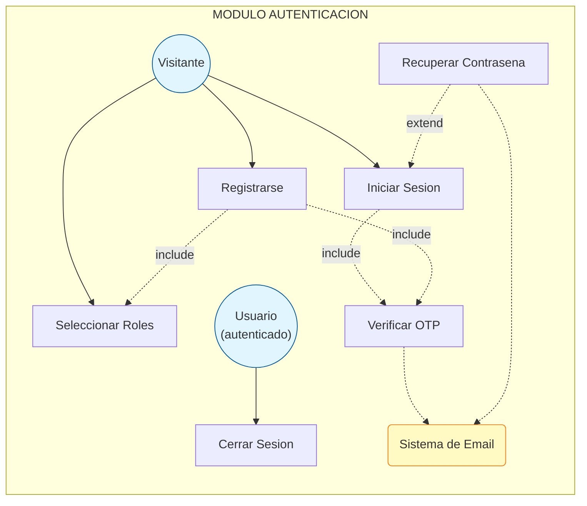

## 5.2 Modulo Cliente

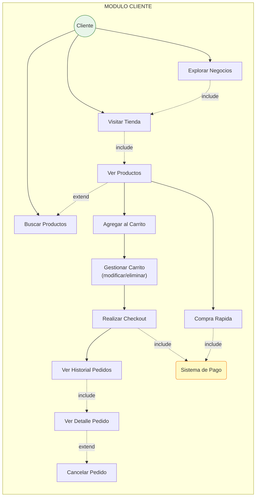

## 5.3 Modulo Emprendedor

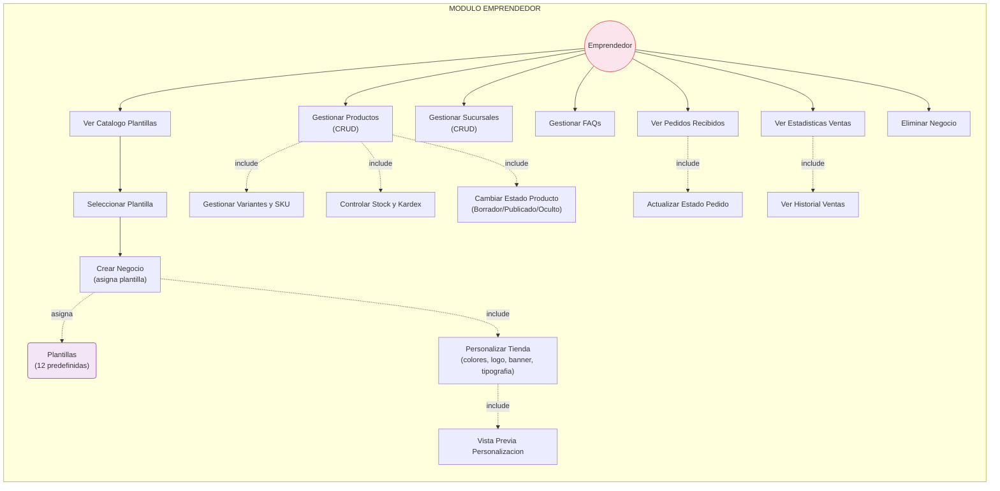

## 5.4 Modulo Repartidor

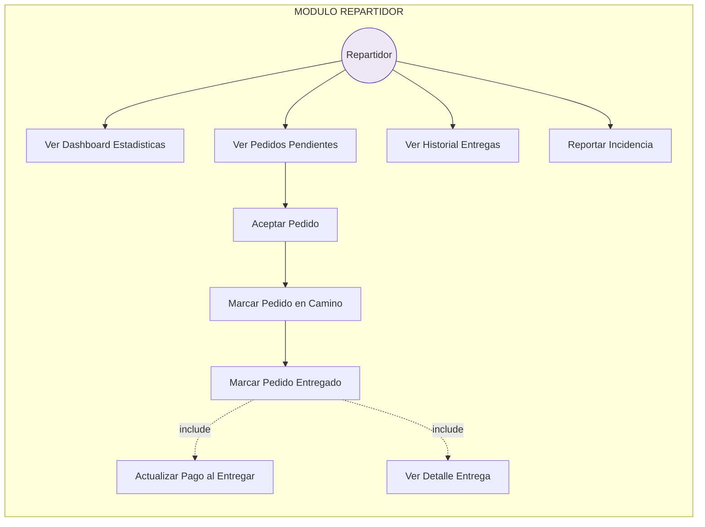

## 5.5 Modulo Administrador

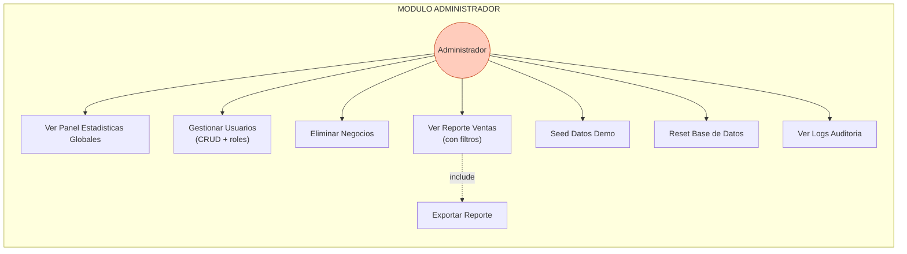

## 5.6 Modulo Sistema (Transversal)

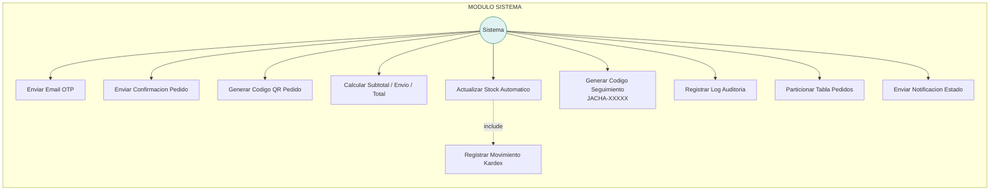

## 5.7 Matriz de Roles vs Casos de Uso

| Caso de Uso | Visitante | Cliente | Emprendedor | Repartidor | Admin | Sistema |
|---|---|---|---|---|---|---|
| **Autenticacion** | | | | | | |
| Registrarse | ✓ | | | | | |
| Iniciar Sesion | ✓ | | | | | |
| Verificar OTP | ✓ | ✓ | ✓ | ✓ | ✓ | |
| Cerrar Sesion | | ✓ | ✓ | ✓ | ✓ | |
| Seleccionar Roles | ✓ | | | | | |
| Recuperar Contrasena | ✓ | | | | | |
| **Cliente** | | | | | | |
| Explorar Negocios | | ✓ | | | | |
| Visitar Tienda | | ✓ | | | | |
| Ver Productos | | ✓ | | | | |
| Buscar Productos | | ✓ | | | | |
| Agregar al Carrito | | ✓ | | | | |
| Gestionar Carrito | | ✓ | | | | |
| Realizar Checkout | | ✓ | | | | |
| Compra Rapida | | ✓ | | | | |
| Ver Historial Pedidos | | ✓ | | | | |
| Ver Detalle Pedido | | ✓ | | | | |
| Cancelar Pedido | | ✓ | | | | |
| **Emprendedor** | | | | | | |
| Ver Catalogo Plantillas | | | ✓ | | | |
| Seleccionar Plantilla | | | ✓ | | | |
| Crear Negocio | | | ✓ | | | |
| Personalizar Tienda | | | ✓ | | | |
| Vista Previa | | | ✓ | | | |
| Gestionar Productos | | | ✓ | | | |
| Gestionar Variantes | | | ✓ | | | |
| Controlar Stock | | | ✓ | | | |
| Cambiar Estado Producto | | | ✓ | | | |
| Gestionar Sucursales | | | ✓ | | | |
| Gestionar FAQs | | | ✓ | | | |
| Ver Pedidos Recibidos | | | ✓ | | | |
| Actualizar Estado Pedido | | | ✓ | | | |
| Ver Estadisticas Ventas | | | ✓ | | | |
| Ver Historial Ventas | | | ✓ | | | |
| Eliminar Negocio | | | ✓ | | | |
| **Repartidor** | | | | | | |
| Ver Dashboard | | | | ✓ | | |
| Ver Pedidos Pendientes | | | | ✓ | | |
| Aceptar Pedido | | | | ✓ | | |
| Marcar en Camino | | | | ✓ | | |
| Marcar Entregado | | | | ✓ | | |
| Ver Detalle Entrega | | | | ✓ | | |
| Actualizar Pago | | | | ✓ | | |
| Ver Historial Entregas | | | | ✓ | | |
| Reportar Incidencia | | | | ✓ | | |
| **Administrador** | | | | | | |
| Panel Estadisticas | | | | | ✓ | |
| Gestionar Usuarios | | | | | ✓ | |
| Eliminar Negocios | | | | | ✓ | |
| Reporte Ventas | | | | | ✓ | |
| Exportar Reporte | | | | | ✓ | |
| Seed Datos Demo | | | | | ✓ | |
| Reset Base Datos | | | | | ✓ | |
| Ver Logs Auditoria | | | | | ✓ | |
| **Sistema** | | | | | | |
| Enviar Email | | | | | | ✓ |
| Enviar Confirmacion | | | | | | ✓ |
| Generar QR | | | | | | ✓ |
| Calcular Totales | | | | | | ✓ |
| Actualizar Stock | | | | | | ✓ |
| Registrar Kardex | | | | | | ✓ |
| Codigo Seguimiento | | | | | | ✓ |
| Log Auditoria | | | | | | ✓ |
| Notificaciones | | | | | | ✓ |

---

# 6. Diagrama PERT

```mermaid
graph LR
    %% Tareas del proyecto
    T1["1. Configuración del Proyecto<br/>(4 días)"]
    T2["2. Diseño de Base de Datos<br/>(6 días)"]
    T3["3. Script SQL (tablas, SP, triggers)<br/>(5 días)"]
    T4["4. Router y Front Controller<br/>(3 días)"]
    T5["5. Controller Base<br/>(2 días)"]
    T6["6. Registro de Usuario<br/>(3 días)"]
    T7["7. Sistema OTP<br/>(4 días)"]
    T8["8. Inicio de Sesión<br/>(3 días)"]
    T9["9. Integración PHPMailer<br/>(2 días)"]
    T10["10. Vistas de Autenticación<br/>(3 días)"]
    T11["11. Dashboard y Roles<br/>(3 días)"]
    T12["12. Perfil de Usuario<br/>(3 días)"]
    T13["13. Plantillas (CRUD + catálogo)<br/>(4 días)"]
    T14["14. Creación de Negocio<br/>(4 días)"]
    T15["15. Personalización de Tienda<br/>(5 días)"]
    T16["16. CRUD de Productos<br/>(5 días)"]
    T17["17. Variantes y Stock<br/>(4 días)"]
    T18["18. Tienda Pública<br/>(4 días)"]
    T19["19. Carrito de Compras<br/>(4 días)"]
    T20["20. Checkout y Pagos<br/>(5 días)"]
    T21["21. Sistema de Pedidos<br/>(4 días)"]
    T22["22. Delivery (Repartidor)<br/>(5 días)"]
    T23["23. Panel de Administración<br/>(5 días)"]
    T24["24. Reportes y Estadísticas<br/>(4 días)"]
    T25["25. Seed y Reset DB<br/>(3 días)"]
    T26["26. Historial Emprendedor + Sucursales<br/>(4 días)"]
    T27["27. Frontend Responsive<br/>(5 días)"]
    T28["28. Documentación Final<br/>(3 días)"]

    %% Dependencias
    T1 --> T2
    T2 --> T3
    T3 --> T4
    T4 --> T5
    T5 --> T6
    T5 --> T8
    T6 --> T7
    T7 --> T9
    T9 --> T10
    T10 --> T11
    T8 --> T11
    T11 --> T12
    T11 --> T13
    T13 --> T14
    T14 --> T15
    T15 --> T16
    T16 --> T17
    T17 --> T18
    T18 --> T19
    T19 --> T20
    T20 --> T21
    T21 --> T22
    T21 --> T24
    T22 --> T23
    T23 --> T25
    T24 --> T25
    T25 --> T26
    T26 --> T27
    T27 --> T28

    %% Tareas paralelas
    T3 --> T4
    T12 --> T13
    T16 --> T17
    T23 --> T24
```

## 6.1 Ruta Crítica

```
T1(4) → T2(6) → T3(5) → T4(3) → T5(2) → T6(3) → T7(4) → T9(2) → T10(3) → T11(3) → T13(4) → T14(4) → T15(5) → T16(5) → T17(4) → T18(4) → T19(4) → T20(5) → T21(4) → T22(5) → T23(5) → T25(3) → T26(4) → T27(5) → T28(3)
```

**Duración total estimada:** 101 días

---

# 7. Diagrama Entidad-Relación

```mermaid
erDiagram
    usuarios ||--o{ usuario_roles : tiene
    usuarios ||--o{ emprendimientos : "es propietario de"
    usuarios ||--o{ pedidos : "realiza"
    usuarios ||--o{ envios_logistica : "asignado a"
    usuarios ||--o{ logs_auditoria : "auditado por"
    usuarios ||--o{ movimientos_kardex : "responsable de"
    usuario_roles }o--|| roles : "pertenece a"
    roles ||--o{ rol_permiso : tiene
    rol_permiso }o--|| permisos : "otorga"

    emprendimientos ||--o{ sucursales : tiene
    emprendimientos ||--o{ productos : contiene
    emprendimientos ||--|| personalizacion_emprendimiento : personaliza
    personalizacion_emprendimiento }o--|| plantillas : usa

    categorias ||--o{ categorias : "se subdivide en"
    categorias ||--o{ productos : clasifica

    productos ||--o{ variantes_producto : tiene
    variantes_producto ||--o{ inventario : controla
    variantes_producto ||--o{ detalles_pedido : "se vende en"
    inventario ||--o{ movimientos_kardex : registra
    inventario }o--|| sucursales : "almacena en"

    sucursales ||--o{ pedidos : origina

    pedidos ||--o{ detalles_pedido : contiene
    pedidos ||--|| envios_logistica : "gestiona envío"

    usuarios {
        bigint id_usuario PK
        varchar nombres
        varchar apellidos
        varchar email UK
        varchar password_hash
        varchar telefono
        mediumblob avatar_blob
        text bio
        varchar ubicacion
        enum estado
    }

    roles {
        int id_rol PK
        varchar nombre_rol UK
    }

    emprendimientos {
        bigint id_emprendimiento PK
        bigint id_propietario FK
        varchar nombre_comercial
        varchar nit UK
        text descripcion
        enum estado
        mediumblob portada_blob
    }

    plantillas {
        int id_plantilla PK
        varchar nombre
        varchar color_primario
        varchar color_secundario
        varchar color_fondo
        varchar color_texto
        boolean activo
    }

    personalizacion_emprendimiento {
        bigint id_personalizacion PK
        bigint id_emprendimiento FK
        int id_plantilla FK
        varchar color_primario
        varchar color_secundario
        varchar color_fondo
        varchar color_texto
        varchar tipografia
        mediumblob logo_blob
        mediumblob banner_blob
        boolean modo_oscuro
        text faqs
    }

    productos {
        bigint id_producto PK
        bigint id_emprendimiento FK
        int id_categoria FK
        varchar nombre
        text descripcion_larga
        json atributos
        mediumblob imagen_blob
        decimal precio_base
        int stock
        enum estado
    }

    variantes_producto {
        bigint id_variante PK
        bigint id_producto FK
        varchar sku UK
        varchar atributo_1
        varchar valor_1
        varchar atributo_2
        varchar valor_2
        decimal precio_adicional
    }

    sucursales {
        bigint id_sucursal PK
        bigint id_emprendimiento FK
        varchar nombre_sucursal
        text direccion
        varchar ciudad
        decimal latitud
        decimal longitud
    }

    pedidos {
        bigint id_pedido PK
        bigint id_cliente FK
        bigint id_sucursal_origen FK
        varchar codigo_seguimiento
        decimal subtotal
        decimal costo_envio
        decimal total
        enum metodo_pago
        enum estado_pago
        enum estado_logistico
        text direccion_entrega
        date fecha_creacion
    }

    detalles_pedido {
        bigint id_detalle PK
        bigint id_pedido FK
        bigint id_variante FK
        int cantidad
        decimal precio_unitario
        decimal subtotal
    }

    envios_logistica {
        bigint id_envio PK
        bigint id_pedido FK UK
        bigint id_repartidor FK
        decimal distancia_km
        int tiempo_estimado_min
        datetime fecha_despacho
        datetime fecha_entrega
    }

    categorias {
        int id_categoria PK
        int id_padre FK
        varchar nombre
        varchar slug UK
    }

    inventario {
        bigint id_inventario PK
        bigint id_variante FK
        bigint id_sucursal FK
        int cantidad_actual
        int alerta_minima
    }

    movimientos_kardex {
        bigint id_movimiento PK
        bigint id_inventario FK
        enum tipo
        int cantidad
        bigint id_usuario_responsable FK
        text observacion
    }

    otp_verificacion {
        bigint id_otp PK
        varchar email
        varchar codigo
        datetime expira_en
        boolean usado
        int intentos
    }

    logs_auditoria {
        bigint id_log PK
        bigint id_usuario FK
        varchar tabla_afectada
        enum accion
        json datos_viejos
        json datos_nuevos
        varchar ip_origen
    }

    permisos {
        int id_permiso PK
        varchar nombre UK
        text descripcion
    }
```

---

# 8. Diagrama de Actividades

## 8.1 Registro de Usuario

```mermaid
flowchart TD
    INICIO(["Inicio"])
    FIN(["Fin"])
    
    INICIO --> A[Ingresar a /registro]
    A --> B[Llenar formulario<br/>nombres, apellidos, email,<br/>teléfono, password]
    B --> C{¿Email ya<br/>registrado?}
    C -->|Sí| D[Mostrar error<br/>"Email ya existe"]
    D --> FIN
    C -->|No| E[Guardar datos en sesión<br/>registro_temp]
    E --> F[Mostrar selección de roles<br/>☐ Cliente ☐ Emprendedor ☐ Repartidor]
    F --> G[Usuario selecciona rol(es)]
    G --> H[Opcional: Subir avatar]
    H --> I[Sistema genera OTP<br/>6 dígitos]
    I --> J[Sistema envía OTP<br/>por correo electrónico]
    J --> K[Usuario ingresa código<br/>en formulario OTP]
    K --> L{¿Código<br/>válido?}
    L -->|Sí| M[Sistema crea usuario<br/>en base de datos]
    M --> N[Sistema asigna rol(es)<br/>al usuario]
    N --> O[Sistema inicia sesión<br/>automáticamente]
    O --> P[Redirigir a /dashboard]
    P --> FIN
    L -->|No| Q{¿Intentos<br/>&lt; 5?}
    Q -->|Sí| R[Mostrar error<br/>"Código incorrecto"]
    R --> K
    Q -->|No| S[Bloquear verificación<br/>Cuenta NO creada]
    S --> FIN
```

## 8.2 Inicio de Sesión

```mermaid
flowchart TD
    INICIO(["Inicio"])
    FIN(["Fin"])
    
    INICIO --> A[Ingresar a /login]
    A --> B[Ingresar email y password]
    B --> C{¿Credenciales<br/>válidas?}
    C -->|No| D[Mostrar error<br/>"Email o contraseña incorrectos"]
    D --> FIN
    C -->|Sí| E[Sistema genera OTP<br/>6 dígitos]
    E --> F[Sistema envía OTP<br/>por correo electrónico]
    F --> G[Usuario ingresa código<br/>en formulario OTP]
    G --> H{¿Código<br/>válido?}
    H -->|Sí| I[Sistema inicia sesión]
    I --> J[Redirigir a /dashboard]
    J --> FIN
    H -->|No| K{¿Intentos<br/>&lt; 5?}
    K -->|Sí| L[Mostrar error<br/>"Código incorrecto"]
    L --> G
    K -->|No| M[Cuenta temporalmente<br/>bloqueada]
    M --> FIN
```

## 8.3 Explorar y Comprar (Cliente)

```mermaid
flowchart TD
    INICIO(["Inicio"])
    FIN(["Fin"])
    
    INICIO --> A[Cliente en /dashboard o /explorar]
    A --> B[Ver lista de negocios<br/>disponibles]
    B --> C[Seleccionar negocio<br/>→ /tienda/{id}]
    C --> D[Ver productos publicados<br/>del negocio con su plantilla]
    D --> E{¿Buscar o<br/>navegar?}
    E -->|Buscar| F[Ingresar término de búsqueda<br/>o filtrar por categoría]
    F --> G[Ver resultados filtrados]
    G --> H[Seleccionar producto]
    E -->|Navegar| H
    
    H --> I[Ver detalle del producto<br/>imagen, precio, descripción,<br/>variantes disponibles]
    I --> J[Seleccionar variante<br/>si aplica]
    J --> K[Definir cantidad]
    K --> L{¿Qué acción<br/>realizar?}
    
    L -->|Agregar al carrito| M[Sistema agrega producto<br/>al carrito en sesión]
    M --> N{¿Qué hacer<br/>después?}
    N -->|Seguir comprando| D
    N -->|Ir al carrito| O[Ver carrito con items<br/>cantidades y total]
    
    L -->|Comprar ahora| O
    
    O --> P[Modificar cantidades<br/>o eliminar items si desea]
    P --> Q[Ir a checkout]
    Q --> R[Confirmar/Elegir dirección<br/>de entrega]
    R --> S[Elegir método de pago<br/>QR | Tarjeta | Efectivo | Transferencia]
    S --> T{¿Método<br/>QR?}
    T -->|Sí| U[Sistema genera código QR<br/>con datos del pedido]
    T -->|No| V[Sistema prepara pedido<br/>sin QR]
    U --> W[Sistema crea pedido]
    V --> W
    W --> X[Transacción:<br/>1. INSERT pedido con tracking<br/>2. INSERT detalles_pedido<br/>3. INSERT envios_logistica]
    X --> Y[Trigger: Actualizar stock<br/>del producto vendido]
    Y --> Z[Mostrar confirmación:<br/>✓ Pedido creado<br/>Código: JACHA-XXXXX<br/>Total: Bs XXX<br/>QR: [imagen]]
    Z --> FIN
```

## 8.4 Gestión de Productos (Emprendedor)

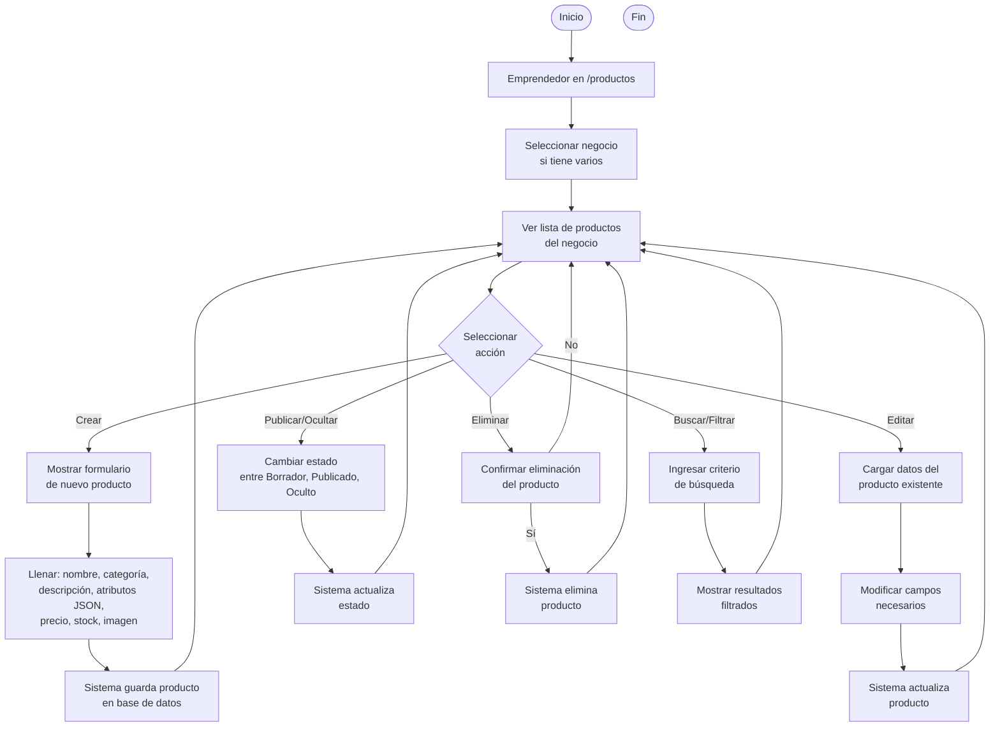

## 8.5 Creación y Personalización de Negocio (Emprendedor)

```mermaid
flowchart TD
    INICIO(["Inicio"])
    FIN(["Fin"])
    
    INICIO --> A[Emprendedor en /dashboard]
    A --> B[Seleccionar "Crear negocio"]
    B --> C[Ver galería de plantillas<br/>disponibles]
    C --> D[Seleccionar plantilla<br/>que más se asemeje al rubro]
    D --> E[Ver detalle de la plantilla<br/>colores, preview]
    E --> F{¿Le gusta<br/>la plantilla?}
    F -->|No| C
    F -->|Sí| G[Llenar formulario:<br/>nombre comercial, NIT, teléfono,<br/>descripción, portada]
    G --> H[Sistema crea negocio<br/>[Transacción SQL]:<br/>1. INSERT emprendimiento<br/>2. INSERT personalizacion<br/>3. INSERT sucursal default]
    H --> I[Redirigir a /plantillas?emp_id=X]
    I --> J[Ver vista previa actual<br/>de la tienda]
    J --> K[Panel de personalización:<br/>colores, logo, banner,<br/>tipografía, modo oscuro, FAQ]
    K --> L[Usuario modifica<br/>algún campo]
    L --> M{¿Previsualizar<br/>o Guardar?}
    M -->|Previsualizar| N[Sistema envía AJAX<br/>y muestra preview en vivo]
    N --> K
    M -->|Guardar| O[Sistema guarda cambios<br/>→ updatePersonalizacion]
    O --> P[Tienda actualizada<br/>con nueva personalización]
    P --> FIN
```

## 8.6 Delivery (Repartidor)

```mermaid
flowchart TD
    INICIO(["Inicio"])
    FIN(["Fin"])
    
    INICIO --> A[Repartidor en /dashboard-repartidor]
    A --> B[Ver dashboard:<br/>estadísticas del día,<br/>pedidos activos, historial]
    B --> C[Sistema consulta pedidos<br/>pendientes vía API JSON]
    C --> D[Mostrar lista de pedidos<br/>pendientes de asignación]
    D --> E[Repartidor selecciona<br/>un pedido pendiente]
    E --> F[Repartidor hace clic<br/>en "Asignarme"]
    F --> G[Sistema asigna repartidor:<br/>UPDATE envios_logistica<br/>UPDATE pedido → "En_Ruta"<br/>fecha_despacho = ahora]
    G --> H[Repartidor se dirige<br/>a recolectar y entregar]
    H --> I[Al completar entrega,<br/>clic en "Entregado"]
    I --> J[Sistema marca entregado:<br/>UPDATE estado → "Entregado"<br/>UPDATE pago → "Completado"<br/>fecha_entrega = ahora]
    J --> K[Dashboard se actualiza<br/>con nueva estadística]
    K --> FIN
```

## 8.7 Administración (Admin)

```mermaid
flowchart TD
    INICIO(["Inicio"])
    FIN(["Fin"])
    
    INICIO --> A[Admin en /admin/panel]
    A --> B[Ver dashboard:<br/>total usuarios, negocios,<br/>productos, pedidos]
    B --> C{Seleccionar<br/>módulo}
    
    C -->|Usuarios| D[Listar usuarios<br/>con sus roles]
    D --> E{Acción}
    E -->|Editar| F[Modificar datos,<br/>roles o estado]
    F --> G[Guardar cambios]
    G --> D
    E -->|Eliminar| H{¿Es super<br/>admin?}
    H -->|Sí| I[Protegido -<br/>No se puede eliminar]
    I --> D
    H -->|No| J[Confirmar y eliminar<br/>usuario]
    J --> D
    
    C -->|Negocios| K[Listar negocios<br/>con dueño]
    K --> L[Seleccionar negocio<br/>a eliminar]
    L --> M[Confirmar eliminación]
    M -->|Sí| N[Eliminar negocio<br/>y datos asociados]
    N --> K
    M -->|No| K
    
    C -->|Ventas| O[Mostrar reporte de ventas<br/>con filtros]
    O --> P[Aplicar filtro<br/>por negocio]
    P --> Q[Aplicar filtro<br/>por fechas]
    Q --> R[Ver resultados:<br/>pedidos, clientes, totales]
    R --> O
    
    C -->|Mantenimiento DB| S{Opciones}
    S -->|Seed Demo| T[Ejecutar script<br/>de datos demo]
    T --> U[Confirmar seed]
    U --> V[Datos insertados<br/>correctamente]
    V --> C
    S -->|Reset DB| W[Ingresar "RESET"<br/>para confirmar]
    W --> X[Borrar todas las tablas<br/>y recrear desde cero]
    X --> C
```

---

# 9. Diagrama de Secuencia

## 9.1 Registro de Usuario

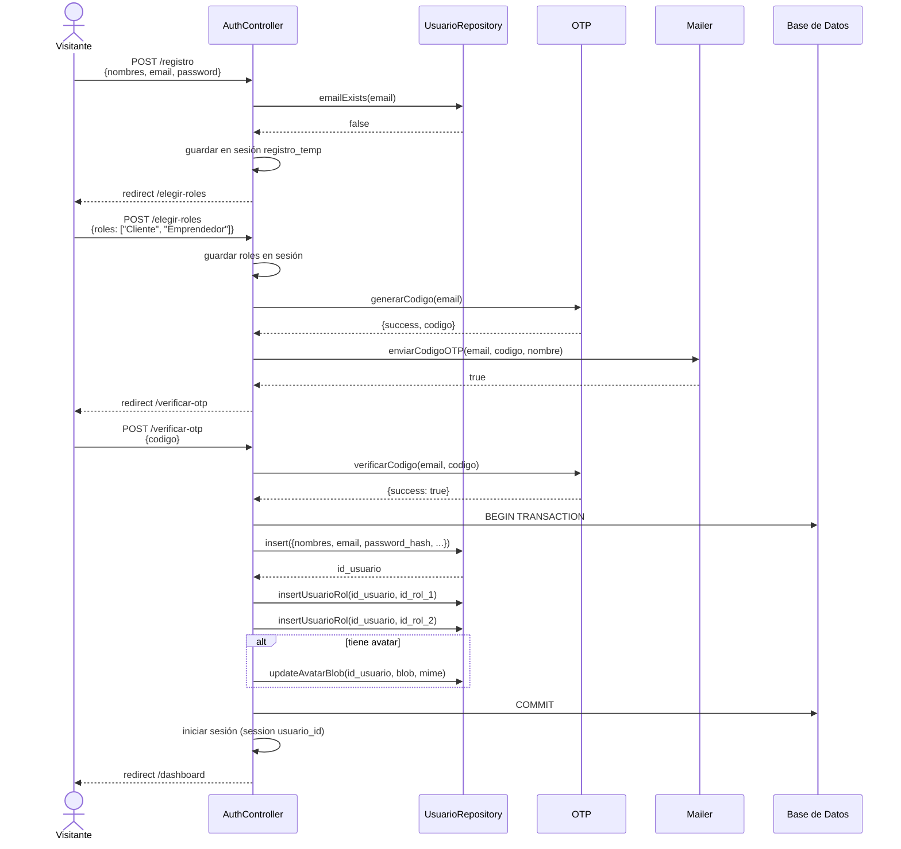

## 9.2 Inicio de Sesión

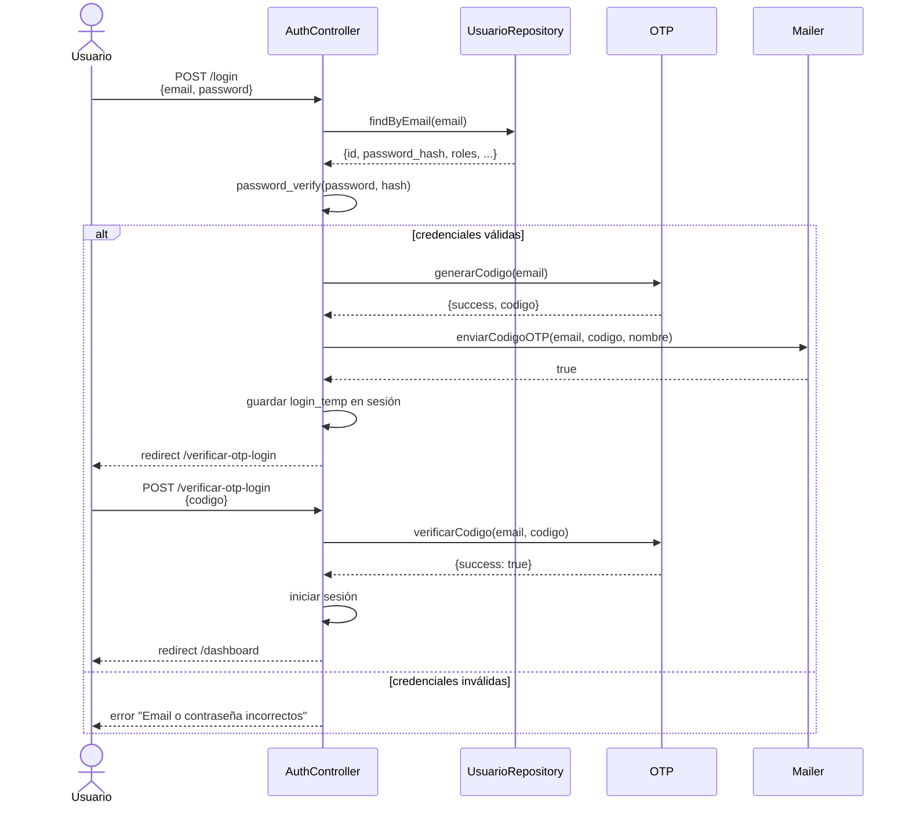

## 9.3 Compra con Carrito y Checkout

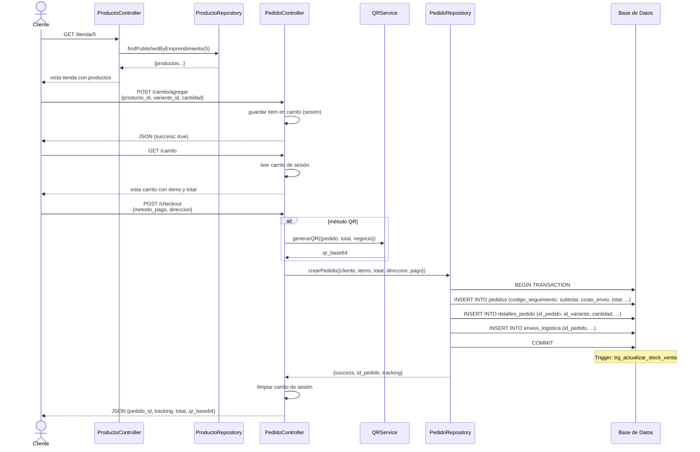

## 9.4 Delivery (Repartidor)

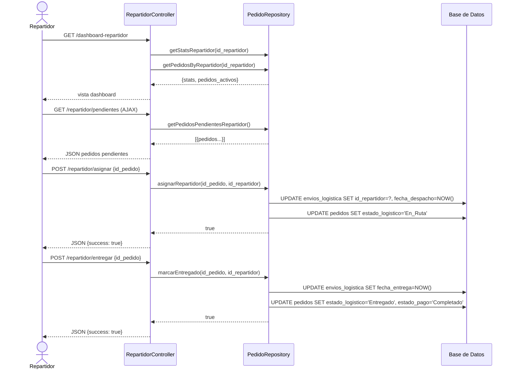

## 9.5 Personalización de Tienda

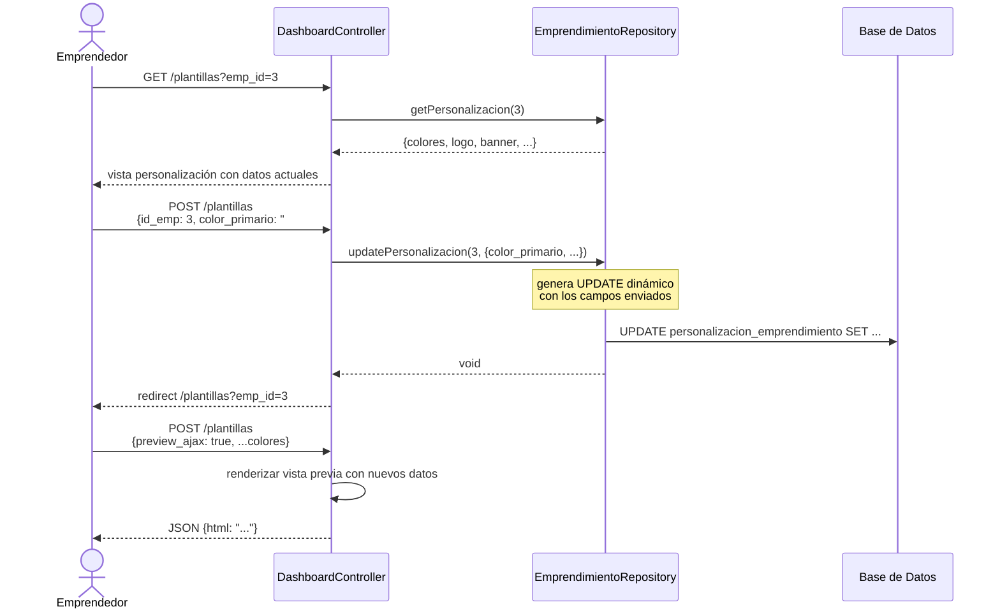

## 9.6 Historial de Pedidos del Emprendedor

```mermaid
sequenceDiagram
    actor E as Emprendedor
    participant DC as DashboardController
    participant ER as EmprendimientoRepository
    participant PER as PedidoRepository

    E->>DC: GET /mis-pedidos
    DC->>ER: findByPropietario(id_usuario)
    ER-->>DC: [{id_emprendimiento, nombre_comercial}]
    
    loop Por cada negocio del emprendedor
        DC->>PER: getPedidosByEmprendimiento(id_emprendimiento)
        PER-->>DC: [{pedido, cliente, items, total, estado}]
    end
    
    DC->>PER: getStatsEmprendedor(id_emprendimiento)
    PER-->>DC: {total_ventas, total_ingresos, pedidos_por_estado}
    
    DC-->>E: vista con tabla de pedidos y estadísticas
```

---

# 10. Diagrama de Clases

```mermaid
classDiagram
    %% ========================
    %% CORE
    %% ========================
    class Router {
        -routes: array
        +get(uri, handler): void
        +post(uri, handler): void
        +match(methods, uri, handler): void
        +dispatch(method, uri): void
        +getRoutes(): array
    }

    class Controller {
        <<abstract>>
        #view(view, data): void
        #redirect(url): void
        #json(data, status): void
        #getDB(): PDO
        #requireAuth(): void
    }

    %% ========================
    %% CONTROLLERS
    %% ========================
    class AuthController {
        -usuarioRepo: UsuarioRepository
        -otp: OTP
        -mailer: Mailer
        +showLoginForm(): void
        +login(): void
        +showRegisterForm(): void
        +register(): void
        +showRoleSelection(): void
        +showVerificarOtp(): void
        +showVerificarOtpLogin(): void
        +verifyOtp(): void
        +verifyOtpLogin(): void
        +sendOtp(): void
        +resendOtp(): void
        +resendOtpLogin(): void
        +logout(): void
        +guardarTempAvatar(): void
    }

    class DashboardController {
        -emprendimientoRepo: EmprendimientoRepository
        -usuarioRepo: UsuarioRepository
        -plantillaRepo: PlantillaRepository
        +dashboard(): void
        +estadisticasCliente(): void
        +showCrearNegocio(): void
        +showPlantillas(): void
    }

    class HomeController {
        -emprendimientoRepo: EmprendimientoRepository
        -plantillaRepo: PlantillaRepository
        +index(): void
        +explorar(): void
        +dbDemo(): void
    }

    class ProductoController {
        -productoRepo: ProductoRepository
        -emprendimientoRepo: EmprendimientoRepository
        -usuarioRepo: UsuarioRepository
        +showTienda(params): void
        +index(): void
    }

    class PedidoController {
        -pedidoRepo: PedidoRepository
        -productoRepo: ProductoRepository
        -emprendimientoRepo: EmprendimientoRepository
        -usuarioRepo: UsuarioRepository
        -qrService: QRService
        +crear(): void
        +comprarRapido(): void
        +agregarAlCarrito(): void
        +verCarrito(): void
        +eliminarDelCarrito(): void
        +checkout(): void
    }

    class RepartidorController {
        -pedidoRepo: PedidoRepository
        +dashboard(): void
        +pedidosPendientes(): void
        +asignar(): void
        +entregar(): void
    }

    class AdminController {
        +panel(): void
        +eliminarUsuario(): void
        +editarUsuario(): void
        +editarUsuarioGuardar(): void
        +eliminarNegocio(): void
        +ventas(): void
        +seedDemo(): void
        +resetDb(): void
    }

    class PerfilController {
        -usuarioRepo: UsuarioRepository
        -emprendimientoRepo: EmprendimientoRepository
        +index(): void
        +actualizar(): void
        +quitarRepartidor(): void
        +eliminarNegocio(): void
    }

    class PlantillaController {
        -plantillaRepo: PlantillaRepository
        +detalle(params): void
        +disponibles(): void
    }

    %% ========================
    %% REPOSITORIES
    %% ========================
    class UsuarioRepository {
        -conn: PDO
        +findByEmail(email): ?array
        +findById(id): ?array
        +getAvatar(id): string
        +getRoles(id): array
        +getRolesNombres(id): array
        +emailExists(email): bool
        +insert(data): int
        +updateAvatarBlob(id, blob, mime): void
        +clearAvatarBlob(id): void
        +insertUsuarioRol(idUsuario, idRol): void
        +getRolIdByName(nombre): ?int
        +getUserRolesInfo(id): ?array
    }

    class EmprendimientoRepository {
        -conn: PDO
        +findByPropietario(id): array
        +findAprobadosExcept(id): array
        +findFeatured(): array
        +findById(id): ?array
        +findByIdAndPropietario(id, prop): ?array
        +insert(data, prop): int
        +getPersonalizacion(id): ?array
        +createDefaultPersonalizacion(id): void
        +updatePersonalizacion(id, data): void
        +findSucursalByEmprendimiento(id): ?array
        +findAllSucursales(id): array
        +insertSucursal(data): int
        +updateSucursal(id, data): void
        +deleteSucursal(id): void
        +countAll(): int
        +countAllUsuarios(): int
    }

    class ProductoRepository {
        -conn: PDO
        +findByEmprendimiento(id): array
        +findPublishedByEmprendimiento(id): array
        +findById(id): ?array
        +findByIdAndEmprendimiento(id, emp): ?array
        +searchByNombreOCategoria(term, emp): array
        +insert(data, emp): int
        +update(id, emp, data): void
        +delete(id, emp): bool
        +countAll(): int
        +queryAllWithPagination(sql, params, limit, offset): array
    }

    class PedidoRepository {
        -conn: PDO
        +crearPedido(datos): array
        +getPedidosPendientesRepartidor(): array
        +asignarRepartidor(pedido, rep): bool
        +getPedidosByRepartidor(rep): array
        +getHistorialRepartidor(rep): array
        +getStatsRepartidor(rep): array
        +getPedidosByCliente(cliente): array
        +getStatsCliente(cliente): array
        +getPedidosByEmprendimiento(emp): array
        +getStatsEmprendedor(emp): array
        +marcarEntregado(pedido, rep): bool
    }

    class PlantillaRepository {
        -conn: PDO
        +findAllActive(): array
        +findById(id): ?array
    }

    %% ========================
    %% MODELS / SERVICES
    %% ========================
    class OTP {
        -conn: PDO
        +generarCodigo(email): array
        +verificarCodigo(email, codigo): array
    }

    class Database {
        -host: string
        -db_name: string
        -username: string
        -password: string
        -conn: PDO
        +getConnection(): PDO
    }

    class Mailer {
        -mail: PHPMailer
        +__construct()
        +enviarCodigoOTP(email, codigo, nombre): bool
        -generarHTMLCorreo(codigo, nombre): string
        +testConnection(): array
    }

    class QRService {
        +generarQR(data): string
    }

    %% ========================
    %% ENTITY CLASSES (Data)
    %% ========================
    class Usuario {
        +id_usuario: bigint
        +nombres: string
        +apellidos: string
        +email: string
        +password_hash: string
        +telefono: string
        +avatar_blob: blob
        +bio: text
        +ubicacion: string
        +estado: enum
        +roles: array
    }

    class Emprendimiento {
        +id_emprendimiento: bigint
        +id_propietario: bigint
        +nombre_comercial: string
        +nit: string
        +telefono: string
        +descripcion: text
        +portada_blob: blob
        +estado: enum
    }

    class Producto {
        +id_producto: bigint
        +id_emprendimiento: bigint
        +id_categoria: int
        +nombre: string
        +descripcion_larga: text
        +atributos: json
        +imagen_blob: blob
        +precio_base: decimal
        +stock: int
        +estado: enum
        +variantes: array
    }

    class VarianteProducto {
        +id_variante: bigint
        +id_producto: bigint
        +sku: string
        +atributo_1: string
        +valor_1: string
        +atributo_2: string
        +valor_2: string
        +precio_adicional: decimal
    }

    class Pedido {
        +id_pedido: bigint
        +id_cliente: bigint
        +id_sucursal_origen: bigint
        +codigo_seguimiento: string
        +subtotal: decimal
        +costo_envio: decimal
        +total: decimal
        +metodo_pago: enum
        +estado_pago: enum
        +estado_logistico: enum
        +direccion_entrega: text
        +fecha_creacion: date
        +detalles: array
    }

    class Plantilla {
        +id_plantilla: int
        +nombre: string
        +descripcion: text
        +color_primario: string
        +color_secundario: string
        +color_fondo: string
        +color_texto: string
        +activo: bool
    }

    class Sucursal {
        +id_sucursal: bigint
        +id_emprendimiento: bigint
        +nombre_sucursal: string
        +direccion: text
        +ciudad: string
    }

    %% ========================
    %% INHERITANCE
    %% ========================
    Controller <|-- AuthController
    Controller <|-- DashboardController
    Controller <|-- HomeController
    Controller <|-- ProductoController
    Controller <|-- PedidoController
    Controller <|-- RepartidorController
    Controller <|-- AdminController
    Controller <|-- PerfilController
    Controller <|-- PlantillaController

    %% ========================
    %% ASSOCIATIONS
    %% ========================
    AuthController *--> UsuarioRepository
    AuthController *--> OTP
    AuthController *--> Mailer

    DashboardController *--> EmprendimientoRepository
    DashboardController *--> UsuarioRepository
    DashboardController *--> PlantillaRepository

    HomeController *--> EmprendimientoRepository
    HomeController *--> PlantillaRepository

    ProductoController *--> ProductoRepository
    ProductoController *--> EmprendimientoRepository
    ProductoController *--> UsuarioRepository

    PedidoController *--> PedidoRepository
    PedidoController *--> ProductoRepository
    PedidoController *--> EmprendimientoRepository
    PedidoController *--> UsuarioRepository
    PedidoController *--> QRService

    RepartidorController *--> PedidoRepository

    PerfilController *--> UsuarioRepository
    PerfilController *--> EmprendimientoRepository

    PlantillaController *--> PlantillaRepository

    AdminController ..> Controller : usa getDB()

    %% Entity relationships
    Usuario "1" --> "*" Emprendimiento : propietario
    Usuario "1" --> "*" Pedido : cliente
    Emprendimiento "1" --> "*" Producto : contiene
    Emprendimiento "1" --> "*" Sucursal : tiene
    Producto "1" --> "*" VarianteProducto : tiene
    Pedido "1" --> "*" VarianteProducto : contiene
```

---

## Leyenda de Funcionalidades Agregadas

Durante la elaboración de esta documentación, se identificaron e incorporaron las siguientes funcionalidades que no existen actualmente en el código base pero que complementan el flujo completo del sistema:

| Funcionalidad | Descripción | Agregada en |
|---|---|---|
| **Carrito de compras** | Agregar, modificar cantidades, eliminar items y ver total. Persiste en sesión PHP. | Diagrama Clases (PedidoController + métodos), Diagrama Secuencia #3, Diagrama Actividades #3 |
| **Pago QR funcional** | Servicio QRService que genera código QR con datos del pedido (monto, tracking, negocio). | Diagrama Clases (QRService), Diagrama Secuencia #3 |
| **Historial emprendedor** | El emprendedor puede ver pedidos recibidos en su negocio con estadísticas de ventas. | Diagrama Clases (PedidoRepository), Diagrama Secuencia #6, RF-55 |
| **Gestión de sucursales** | CRUD completo de sucursales (listar, crear, editar, eliminar). | Diagrama Clases (EmprendimientoRepository), HU-19 |
| **Búsqueda de productos** | Búsqueda de productos por nombre y categoría en la tienda pública. | Diagrama Clases (ProductoRepository), RF-33 |

---

*Documentación generada el 30 de mayo de 2026 para el proyecto JACHAmarket — Marketplace Multiroles.*
